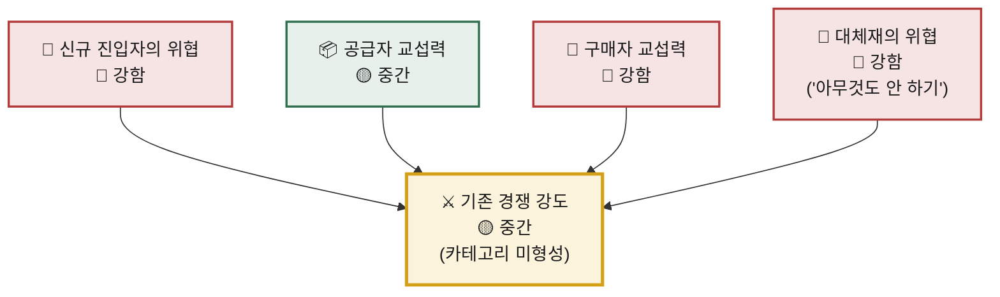

# 개인카페의 고객 획득을 도와주는 개인카페 통합 리워드 시장에 대한 포터의 5가지 힘 분석

> **분석 프레임:** 본 폴더 `methodology.md`의 체크리스트 0~7번을 순서대로 적용했습니다.
> **입력 자료:** `business-one-pager.md` · `deep-research-report.md` · `00-아이디에이션/개인카페_통합스탬프_서비스기획.md`
> **작성일:** 2026-08-13
> **표기 규약:** ⚠️ 는 실측·검증 전 수치입니다. 본 분석의 정량 근거는 대부분 이 상태이며, 결론의 신뢰 구간은 부록 A를 참조하십시오.

---

## 0. 산업 범위 정의 — 결론을 좌우하는 첫 결정

Five Forces는 **산업 경계를 어디에 긋느냐에 따라 결론이 반대로 나오는** 도구입니다. 따라서 경계를 먼저 확정합니다.

| 후보 | 산업 정의 | 이 정의에서의 경쟁자 | 채택 |
|---|---|---|---|
| A | 로컬 매장 멤버십·CRM SaaS | 도도포인트, 네이버 플레이스 단골, 터칭 | **인접 산업** |
| **B** | **개인카페의 고객 획득 지출을 다투는 로컬 광고·리워드 시장** | 네이버 플레이스 광고, 인스타그램 광고, 지역 광고 대행사, 통합 리워드 사업자 | **✅ 주 산업** |
| C | 통합 포인트·리워드 네트워크 | OK캐쉬백, 해피포인트, 카드사 제휴 포인트 | **구조 참조군** |

**B를 주 산업으로 채택한 근거는 '돈의 출처'입니다.**

- 개인카페가 이 서비스에 지불하는 돈은 멤버십 예산이 아니라 **마케팅 예산**에서 나옵니다. 카페 1곳의 월 마케팅 지출은 ⚠️약 10만원, 매출 대비 1.25% 수준으로 추정됩니다.
- 이탈 시 그 예산이 흘러가는 곳은 다른 멤버십 SaaS가 아니라 **네이버 플레이스 광고와 인스타그램 광고**입니다.
- 즉 이 시장의 실체는 "리워드 시스템"이 아니라 **개인카페가 마케팅비를 지불하고 신규 고객 접점을 구매하는 시장**이며, 스탬프는 그 인터페이스입니다.

> **산업 규모(TAM):** 개인카페 ⚠️약 8만개 × 연 마케팅비 ⚠️약 120만원 = ⚠️**약 960억원 / 년**
> 이 숫자는 이후 모든 판정의 분모입니다. 시장은 **파이가 정해진 지갑 점유율 싸움**이며, 새로 창출되는 예산이 아닙니다.

### 이 산업의 구조적 특이점 — 점주가 공급자이면서 구매자다

개인카페 점주는 **리워드 재고(도장·쿠폰)를 공급하는 공급자**이면서, 동시에 **마케팅 예산을 집행하는 구매자**입니다. 두 역할의 교섭력이 서로 다른 방향으로 작동하므로, 본 분석에서는 **두 힘을 분리해 각각 평가**합니다.

---

## 1. 신규 진입자의 위협 — 🔴 **강함**

- **기술 장벽이 사실상 존재하지 않습니다.** QR 스캔, 도장 적립, 쿠폰 발행은 특허나 독점 기술이 아닌 범용 기능입니다. 네이버 플레이스는 '단골·스탬프' 기능을 **이미 무료로** 제공하고 있고, 터칭은 스탬프·포인트·쿠폰·결제를 통합 제공합니다. 즉 기능 자체는 이미 시장에 무료로 존재합니다.
- **초기 자본 요구량이 낮습니다.** 앱·서버 초기 개발비는 ⚠️5천만~1억원 규모로 추정되며, 스타트업 1개 팀이 감당 가능한 수준입니다. 규모의 경제가 작동하는 원가 항목(생산설비·재고·물류)이 아예 없는 소프트웨어 사업입니다.
- **가장 위험한 진입자는 신규 창업자가 아니라 기존 사업자입니다.** 네이버·카카오는 지도·플레이스·결제·로그인·가맹망을 모두 보유하고 있어, **기능 하나를 얹는 것만으로** 이 시장에 진입합니다. POS·장부 사업자(캐시노트, 페이히어)와 기존 멤버십 SaaS(도도포인트 ⚠️누적 가입자 2,500만~3,500만) 역시 이미 확보한 가맹점 위에서 진입 비용이 거의 0입니다.
- **규제가 방벽이 되지 못합니다.** 전자금융거래법상 선불전자지급수단 등록 요건(⚠️자본금 20억원 등)은 **자금을 보관하는 모델에만** 걸리는 조건부 장벽입니다. 현재 설계는 플랫폼 수수료 0%로 카페 간 자금을 통과시키는 구조여서, 이 장벽의 **보호를 받지 못하면서** 법률 검토 부담만 지고 있습니다.
- **후발자는 검증된 상권만 골라 들어올 수 있습니다.** 어느 상권에서 이 모델이 작동하는지를 우리가 먼저 실증하면, 후발자는 그 상권에 인력을 집중 투입하는 체리피킹이 가능합니다. 선발자 비용은 우리가 치르고 학습은 경쟁자가 취합니다.

> **완화 요인 — 유일한 실질 장벽은 오프라인 커버리지입니다.** 12곳 완주 제품이 작동하려면 상권 내 **최소 25곳 이상, 커버리지 60%**가 필요합니다. 이 밀도는 코드로 복제되지 않고 발로 뛴 영업의 결과이며, 임계를 넘긴 상권에서는 강력한 네트워크 효과이자 진입 장벽이 됩니다.
> **다만 이 장벽은 '상권 국소적'입니다.** 홍대에서 커버리지 60%를 확보해도 성수동은 백지이며, 경쟁자는 우리가 없는 상권부터 진입합니다. 전국 단위 방어선이 형성되기까지의 시간이 이 사업의 최대 취약 구간입니다.

> **사업적 함의:** 진입 장벽을 **기술이나 자본이 아니라 상권 커버리지 속도**로 쌓아야 합니다. 확장 단위를 '전국'이 아니라 '상권'으로 두고, 상권 하나를 얼마나 빨리·싸게 임계까지 채우는지가 방어력의 전부입니다.

---

## 2. 기존 경쟁자 간의 경쟁 — 🟡 **중간**

- **동일 정의의 직접 경쟁자가 사실상 부재합니다.** "서로 다른 매장 방문을 보상하고 그 원가를 매장들이 분담하는" 모델의 국내 사업자는 확인되지 않습니다. 가장 인접한 커클(니어라운드, 2023년 설립)은 제휴 카페 ⚠️300~400곳 규모의 **할인 패스 판매** 모델로, 적립 단위를 행동으로 옮긴 구조는 아닙니다. **카테고리 자체가 미형성 상태**이며, 이 때문에 가격 인하 경쟁·광고 출혈 경쟁이 아직 발생하지 않았습니다.
- **그러나 산업을 B로 정의하면 경쟁은 이미 시작되어 있습니다.** 우리가 다투는 대상은 같은 컨셉의 스타트업이 아니라 **네이버 플레이스 광고와 인스타그램 광고**입니다. 이들은 카페 마케팅 예산의 대부분을 이미 점유하고 있으며, 현재 설계의 지갑 점유율(SOW)은 ⚠️**7.3%**에 불과합니다. 카페가 쓰는 100원 중 7원만 가져오는 구조입니다.
- **인접 SaaS가 같은 가격 밴드를 선점했습니다.** 도도포인트의 점주 과금은 월 1만~5만원 수준이며, 계획 중인 Pro 구독료 19,000원은 정확히 이 밴드 안에 있습니다. 신규 지출을 창출하는 것이 아니라 **기존 지출을 대체해 달라고 요구**하는 싸움입니다.
- **시장 성장률은 경쟁을 완화하는 방향입니다.** 글로벌 로열티 관리 시장은 ⚠️CAGR 14.6%(2026년 164억달러 → 2031년 325억달러)로 성장 중이며, 성장 시장에서는 점유율을 빼앗지 않아도 규모를 키울 여지가 있습니다. 국내 개인카페 리워드 영역은 아직 초기 성장기입니다.
- **고정비와 철수 장벽이 낮아 출혈 경쟁 유인이 약합니다.** 설비·재고가 없는 소프트웨어 사업이므로, 가동률을 채우기 위해 원가 이하로 파는 압력이 구조적으로 발생하지 않습니다. 다만 **무료 대체재(네이버 플레이스 단골)가 가격 상한을 이미 눌러놓은** 상태여서, 경쟁이 없는데도 가격 결정권은 좁습니다.

> **판정 근거:** 직접 경쟁 부재(약함 요인)와 예산 경합·가격 상한(강함 요인)이 상쇄되어 **중간**으로 판정합니다.
> **단, 이 판정은 시간에 따라 악화하는 방향입니다.** 모델이 검증되는 순간 카테고리가 형성되고, §1의 낮은 진입 장벽 때문에 경쟁 강도는 곧 🔴로 이동합니다. **현재의 '중간'은 카테고리가 미형성이라 얻은 유예 기간이며, 구조적 안전이 아닙니다.**

---

## 3. 구매자의 교섭력 — 🔴 **강함**

이 산업의 구매자는 두 층입니다. **① 마케팅 예산을 집행하는 개인카페 점주(과금 대상)** 와 **② 리워드를 소비하는 최종 고객**입니다.

### ① 개인카페 점주 — 🔴 강함

- **전환 비용이 실질적으로 0입니다.** 월 19,000원 구독은 언제든 해지 가능하고, 장기 계약·최소 약정·데이터 락인이 없습니다. 여기에 **개인카페 3년 생존율 53.2%, 5년 34.6%** 라는 구조적 이탈이 겹칩니다. 즉 리텐션 붕괴가 경쟁 때문이 아니라 폐업 때문에도 발생하며, 폐업으로 인한 미정산 채권 손실은 상시 비용이 됩니다.
- **무료 대체재가 지불의향의 상한을 눌러놓았습니다.** 네이버 플레이스 단골·스탬프는 무료이며, 점주 입장에서 우리의 차별점은 **"매장 간 통합" 단 하나**입니다. 이 하나의 가치가 월 19,000원을 정당화하지 못하면 가격 결정권은 전부 구매자에게 있습니다.
- **제품이 고도로 표준화되어 있습니다.** 적립·쿠폰·알림·리포트는 어느 서비스나 제공하는 기능 집합이며, 점주가 비교·교체할 때의 학습 비용이 낮습니다.
- **후방 통합이 실제로 가능합니다.** 상권 상인회나 카페 사장 커뮤니티가 **종이 카드로 직접 스탬프 투어를 운영**할 수 있습니다. 지자체 스탬프 투어가 이미 이 포맷을 검증했고, 원가는 인쇄비 수준입니다. 플랫폼을 건너뛰는 경로가 현실적으로 열려 있습니다.
- **점주가 가치를 체감하기 어려운 구조적 문제가 있습니다.** 도장을 찍는 카페와 쿠폰을 받는 카페가 대부분 동일 주체이므로, 지출과 수입이 같은 주머니에서 상계됩니다. 월 정산 순액이 **평균 −2,607원**(도장 손님 1명당 52원)으로 작다는 것은 부담이 작다는 뜻이지만, 동시에 **이득도 작아 보인다**는 뜻입니다.

### ② 최종 고객 — 🔴 강함

- 전환 비용이 0이며, 앱 하나를 더 설치·유지할 이유가 매번 재평가됩니다. 통합 멤버십의 선례(시럽·클립·스마트월렛 **전부 종료**)가 보여준 실패 원인이 정확히 이 지점입니다.
- 리워드가 3,000원 금액권 / 유효기간 10일이라 **락인이 약합니다.** 완주까지 서로 다른 카페 12곳이라는 긴 경로를 요구하는 반면, 중도 이탈 비용은 0입니다.
- 다만 **수요측 관심 자체는 존재합니다** — 소비자의 비프랜차이즈 카페 선호는 54.0%입니다. 문제는 수요 창출이 아니라 발견 인프라의 부재이며, 이는 매칭 효율화 과제입니다.

> **완화 요인 — 임계 커버리지가 집단 락인을 만듭니다.** 구매자 집중도는 매우 낮습니다(8만개 파편화). 개별 카페의 교섭력은 미약하며, 커버리지 60%를 달성한 상권에서는 **이탈이 곧 자기 손실**(우리 손님이 다른 카페에서 쓸 쿠폰을 우리만 못 받는 상태)이 되어 개별 이탈 유인이 급감합니다. **임계를 넘긴 상권 안에서는 이 힘이 🟡로 내려갈 여지가 있습니다.**

> **사업적 함의:** 이 사업의 정당성은 **단가가 아니라 검증 가능성**에 있습니다. 쿠폰 사용은 실제 방문이 발생했다는 확정 이벤트이므로, 네이버·인스타가 제공하지 못하는 **"성과 증명"** 을 근거로 더 큰 지갑 칸을 요구할 수 있습니다. 성과 과금(CPA) 전환이 구매자 교섭력에 대한 유일한 구조적 응답입니다.

---

## 4. 공급자의 교섭력 — 🟡 **중간**

이 산업의 공급자는 세 종류로, 교섭력이 서로 크게 다릅니다.

| 공급자 유형 | 대상 | 교섭력 |
|---|---|---|
| ① 리워드 재고 공급자 | 개인카페 점주(도장·쿠폰 원가 부담자) | 🟡 개별 약함 / 집단 강함 |
| ② 인프라 공급자 | 클라우드, PG, 문자·푸시 발송, 앱스토어 | 🟢 약함 |
| ③ 채널·데이터 공급자 | 네이버 지도·플레이스, 카카오 로그인·선물하기 | 🔴 강함 |

- **② 인프라는 완전히 상품화되어 있어 교섭력이 낮습니다.** 클라우드(AWS·네이버클라우드), PG, 알림 발송은 다수 사업자가 경쟁하며 전환 비용이 낮습니다. 무엇보다 **원가 비중이 낮습니다** — 서버·소프트웨어 비용은 ⚠️연 1천만원 수준으로 추정되며, 원가의 대부분은 인건비(자체 통제 항목)입니다. 공급자가 원가의 대부분을 쥐고 있을 때 갑이 된다는 조건이 성립하지 않습니다.
- **① 점주는 개별 교섭력이 미약하지만, 집단으로는 사실상 결정권을 가집니다.** 리워드 원가 3,000원은 도장을 찍은 12곳이 250원씩 분담하므로 **플랫폼의 리워드 원가는 0원**입니다. 이는 공급 원가 구조에서 플랫폼이 절대적으로 유리한 지점입니다. 그러나 커버리지가 곧 제품 성능이므로, **25곳 미달 시 제품 가치는 부분적으로 나쁜 것이 아니라 0**입니다. 개별 점주는 힘이 없지만 **집단 이탈은 서비스를 즉시 정지시킵니다.**
- **③ 채널 공급자가 가장 위험한 공급자입니다.** 접근성을 높이는 가장 효율적인 경로는 네이버·카카오 연동인데, 이들은 **동시에 §1의 최대 잠재 진입자**입니다. 지도 데이터·로그인·선물하기에 의존하는 만큼 정책 변경 리스크에 노출되며, 이는 교과서적 **전방 통합 위험**입니다 — 공급자가 우리를 건너뛰고 직접 최종 고객에게 같은 가치를 제공할 수 있고, 네이버 플레이스 단골·스탬프로 **이미 그 일부를 하고 있습니다.**

> **판정 근거:** 원가를 지배하는 공급자가 없고 리워드 원가가 0이라는 강력한 완화 요인(🟢)이, 점주 집단 이탈 위험과 플랫폼 의존(🔴)과 상쇄되어 **중간**입니다.

> **사업적 함의:** 인프라 공급자는 협상 대상이 아니고, 관리해야 하는 공급자는 **점주 집단과 네이버·카카오** 두 곳뿐입니다. 전자는 상권 단위 리텐션 설계로, 후자는 **의존도를 기능이 아닌 유입 채널 수준으로 제한**해 대응해야 합니다. 핵심 자산(방문 동선 데이터)이 채널 밖에 축적되는 구조를 유지하는 것이 핵심입니다.

---

## 5. 대체재의 위협 — 🔴 **강함**

- **가장 강력한 대체재는 "아무것도 안 하기"입니다.** 개인카페의 마케팅 지출은 매출의 ⚠️1.25%(월 ⚠️약 10만원)로, **지출 자체가 선택 사항**입니다. 신규 고객 확보를 포기하고 단골과 입지에 의존하는 것이 다수 개인카페의 현재 상태이며, 이 대체재의 가격은 0원, 관리 부담도 0입니다. **경쟁 상대가 다른 서비스가 아니라 '무행동'일 때 시장은 가장 어렵습니다.**
- **인스타그램 자체 운영이 무료 대체재로 이미 자리 잡았습니다.** 개인카페의 신규 고객 도달 채널은 사실상 인스타그램 하나이며, 계정 운영·릴스 게시는 광고비 0원입니다. 성과 측정이 불가능하다는 약점이 있으나, 점주에게는 **이미 익숙하고 통제권이 자기에게 있다**는 비가격 우위가 있습니다.
- **종이 스탬프 카드는 원가와 정서 양쪽에서 강한 대체재입니다.** 인쇄비는 장당 수십원 수준이고, 점주와 손님 모두 실물 카드를 선호하는 경향이 관찰됩니다. 앱 설치·직원 교육·기기 도입이 필요 없다는 점이 소규모 매장에서는 결정적입니다.
- **수요측에서도 탐색 욕구는 이미 대체되고 있습니다.** 네이버 지도 저장, 인스타 해시태그, 다이닝코드, 캐치테이블로 "오늘 어디 갈까"는 리워드 없이도 해결됩니다. 리워드는 **없어도 되는 부가물**이라는 위치에서 시작합니다.
- **가격·성능 비교에서는 우리가 우위입니다 — 그러나 그것만으로 전환이 일어나지 않습니다.** 도장 손님 1명당 실부담 52원은 인스타그램 CPC ⚠️약 1,650원의 3% 수준이고, 소상공인 평균 온라인 광고비(⚠️명당 160원)의 3분의 1입니다. 성과 지표상 압도적이지만, **전환 비용이 0인 시장에서 가격 우위는 방어력이 되지 못합니다.** 대체재로 돌아가는 비용도 똑같이 0입니다.

> **사업적 함의:** 대체재 대응은 가격 경쟁이 아니라 **"대체재가 제공하지 못하는 것"** 으로만 가능합니다. 인스타·종이 카드·무행동이 공통으로 제공하지 못하는 것은 **① 실제 방문이 발생했다는 검증된 성과 데이터**와 **② 다른 카페가 우리 가게로 손님을 보내주는 상호 유입**입니다. 이 두 가지가 아니라면 어떤 메시지도 대체재에 밀립니다.

---

## 6. 5가지 힘 종합 — 강도 지도

| 힘 | 강도 | 핵심 이유 | 가설 대비 |
|---|:--:|---|:--:|
| 신규 진입자의 위협 | 🔴 **강함** | 기술·자본 장벽 부재. 네이버·카카오·POS 사업자의 진입 비용이 거의 0 | 가설 일치 |
| 기존 경쟁 강도 | 🟡 **중간** | 직접 경쟁자 부재하나 로컬 광고와 예산 경합. 성공 시 🔴로 이동 | 가설 일치 |
| 구매자 교섭력 | 🔴 **강함** | 전환 비용 0 + 무료 대체재 + 3년 생존율 53% | 가설 일치 |
| 공급자 교섭력 | 🟡 **중간** | 리워드 원가 0원(강한 완화) vs 점주 집단 이탈·플랫폼 의존 | 가설 일치 |
| 대체재의 위협 | 🔴 **강함** | "아무것도 안 하기"가 가격 0·부담 0의 최강 대체재 | 가설 일치 |

> `business-one-pager.md` §7.2의 착수 가설 5건은 모두 검증되었습니다. 다만 **공급자 교섭력의 근거가 가설과 다릅니다** — 가설은 "집단 이탈 위험"만을 보았으나, 실제로는 **리워드 원가가 0원**이라는 강력한 완화 요인이 함께 작동해 중간을 유지합니다.

---

## 7. 종합 결론

### 산업 매력도: **낮음** (🔴 3 / 🟡 2 / 🟢 0)

**다섯 힘 중 셋이 강하고 둘이 중간이며, 약한 힘이 하나도 없습니다.** 포터의 프레임에서 이는 구조적으로 수익성이 낮은 산업을 뜻합니다. 판정의 근거는 세 가지로 압축됩니다.

- **가격 결정권이 우리에게 없습니다.** 무료 대체재(네이버 플레이스 단골)와 무행동 대체재(마케팅 지출 자체를 안 함)가 지불의향의 천장을 이미 눌러놓았습니다. 우리가 정할 수 있는 것은 가격이 아니라 **가격을 정당화할 증거**뿐입니다.
- **성공이 곧 경쟁 유발입니다.** 진입 장벽이 기술·자본이 아니라 발로 뛴 상권 커버리지 하나에 걸려 있어, 모델이 검증되는 순간 자본과 가맹망을 이미 가진 사업자가 곧바로 뒤따라옵니다. **검증 이전에는 시장이 없고, 검증 이후에는 경쟁이 있습니다.**
- **구매자와 공급자가 동일 주체여서 이탈이 양쪽에서 동시에 일어납니다.** 점주 한 곳의 이탈은 매출 감소이면서 동시에 제품 성능 저하입니다. 3년 생존율 53.2%라는 외생 변수가 이 이탈을 상시화합니다.

### 잠재 수익성: **현재 수익 모델로는 성립하지 않습니다**

산업 매력도보다 더 시급한 문제는 **수익 규모의 절대값**입니다.

| 구분 | 값 | 판단 |
|---|---|---|
| 산업 전체(TAM) | ⚠️ 960억원/년 | 성숙 시장 대비 작지 않음 |
| 도달 가능 시장(SAM) | ⚠️ 240억원/년 | — |
| 3년 목표(SOM, 3,000곳) | ⚠️ 36억원/년 | — |
| **SOM 내 실매출 (S1 · 현 BM, SOW 7.3%)** | ⚠️ **2.6억원/년** | **연 고정비 추정 ⚠️10~20억원에 미달** |
| SOM 내 실매출 (S2 · 광고 네트워크, SOW 30%) | ⚠️ 10.8억원/년 | 손익분기 근접 수준 |

**핵심 결론은 이것입니다 — 목표 상권 100곳을 전부 점령해도 현재 수익 모델(구독 + 낙전)로는 연 매출 ⚠️2.6억원에 그칩니다.** 5가지 힘의 압력은 이 얇은 수익 구조를 견딜 여유를 주지 않습니다. 지갑 점유율을 7.3%에서 30%로 끌어올리는 경로(S2 광고 네트워크 전환)를 확보하지 못하면, **분석 결과가 아무리 좋아도 사업 상한이 낮게 고정됩니다.**

### 그럼에도 이 시장을 볼 이유 — 매력은 시장이 아니라 자산에 있습니다

산업 매력도가 낮다는 결론이 "하지 말라"는 뜻은 아닙니다. 포터의 프레임은 **산업의 평균 수익률**을 말하며, 평균 이하 산업에서도 특정 포지션은 초과 수익을 냅니다. 이 사업에서 그 포지션의 근거는 두 가지입니다.

- **비프랜차이즈 개인카페의 방문 동선 데이터는 네이버·카카오도 보유하지 않습니다.** 결제 데이터는 있으나 매장 단위 식별과 연속 방문 패턴은 없습니다. 이 자산은 상권 리포트·창업 컨설팅·브랜드 마케팅·결제로 확장되는 여러 수익 모델의 공통 기반이며, **낮은 초기 수익성이 곧 자산 형성 기간**이라는 해석을 가능하게 합니다.
- **고객 획득 비용이 구조적으로 0에 수렴합니다.** 매장 QR이 곧 앱 사용자 획득 채널이므로, 참여 카페가 늘수록 획득 채널이 자동으로 늘어납니다. 대체재 대비 가격 우위(손님당 52원 vs 인스타 CPC ⚠️1,650원)는 방어력은 못 되지만, **적자를 버티는 체력**은 됩니다.

### 도출 전략: **집중화(Focus)** — 상권 단위 국소 독점

`methodology.md` 체크리스트 7번에 대한 답입니다. 저비용·차별화·집중화 중 **집중화**를 채택합니다.

- **저비용은 불가합니다.** 대체재의 가격이 0원(무행동·인스타·종이 카드)이므로 가격으로는 이길 수 없습니다.
- **전면적 차별화도 어렵습니다.** 기능이 표준화되어 있고 차별점은 "매장 간 통합" 하나입니다.
- **집중화가 유일하게 5가지 힘 모두에 동시 대응합니다.** 좁은 상권에 커버리지 60%를 몰아넣으면 ① 진입 장벽이 생기고(신규 진입자 ↓) ② 이탈이 자기 손실이 되고(구매자 교섭력 ↓) ③ 집단 이탈 유인이 줄고(공급자 교섭력 ↓) ④ 다른 카페의 상호 유입이라는 대체 불가 가치가 생기고(대체재 ↓) ⑤ 국소 독점으로 예산 경합에서 빠져나옵니다(경쟁 강도 ↓).

> **전략 명제:** 이 사업의 승패는 시장 크기가 아니라 **상권 하나를 임계 밀도까지 채우는 단위 비용과 속도**로 결정됩니다. 사업 계획·조직·재무 모델 전부가 상권 단위로 설계되어야 합니다.

### 실행 전 확인해야 할 세 가지

본 분석은 실측 0건 상태의 가정 위에 서 있습니다. 결론을 뒤집을 수 있는 순서대로 제시합니다.

| 순위 | 확인 항목 | 뒤집히는 결론 | 확인 방법 |
|:--:|---|---|---|
| 1 | **12칸 도달률 20%** | 미달 시 제품이 작동하지 않아 다섯 힘 분석 자체가 무의미 | 컨시어지 MVP(종이 카드 2주) |
| 2 | **개인카페 월 마케팅비 10만원** | TAM 960억원 전체가 이 값 위에 있음. 절반이면 시장이 절반 | 점주 인터뷰 5곳 |
| 3 | **SOW를 30%까지 올릴 수 있는가(S2 전환)** | 불가 시 산업 매력도 '낮음'이 사업 결론으로 확정 | 점주 성과 과금 지불의향 조사 |

> 1번이 미달이면 나머지는 검토할 필요가 없습니다. **본 분석의 다음 관문은 추가 분석이 아니라 실측입니다.**

---

## 부록 A · 본 분석의 근거 신뢰도

| 근거 | 상태 | 영향 범위 |
|---|---|---|
| 개인카페 약 8만개 (차감 추정) | ⚠️ 통계청 사업체 수 107,055개 − 프랜차이즈 22,000~29,101개 | TAM 분모 |
| 개인카페 월 마케팅비 10만원 | ⚠️ 추정(소상공인 온라인광고비 월 24만원의 절반 이하로 보수 추정) | TAM 전체 |
| 밀집 상권 개인카페 20,000곳 (SAM) | ⚠️ 근거 없음 | SAM |
| 12칸 도달률 20% · 쿠폰 소멸률 30% | ⚠️ 미검증 | 단위 경제 전체 |
| 도장 손님당 실부담 52원 | ⚠️ 도달률 20% 전제 하의 계산값 | §5 가격 비교 |
| 도도포인트 누적 가입자 | ⚠️ 자료 간 상충(2,500만 / 3,200만 / 3,500만) — 원자료 확인 필요 | §1 진입자 규모 |
| 전자금융업 등록 요건·면제 기준 | ⚠️ 법률 검토 전 | §1 규제 장벽 판정 |
| 해외 사례(FiveStars 인수 · Belly 종료 등) | ⚠️ 미검증 | §2 보조 근거 |
| 커피전문점 사업체 수 · 생존율 · 소비자 선호 54% | 통계청·국세청·오픈서베이 | 상대적으로 견고 |

**요약:** 힘의 **방향과 순위**는 정성 근거(전환 비용, 무료 대체재, 진입 장벽 부재, 생존율)에 기반해 견고합니다. 반면 **수익성 절대값**은 검증 전 수치 위에 있어 신뢰 구간이 넓습니다. 따라서 §7의 "산업 매력도 낮음"은 유지 가능한 결론이나, "연 2.6억원"은 **자릿수 수준의 참고값**으로만 사용해야 합니다.

---

## 부록 B · 출처

`business-one-pager.md` 부록 B의 출처를 계승합니다. 본 분석에서 추가로 참조한 자료는 다음과 같습니다.

- 국내외 경쟁 플랫폼 현황 · 규제 검토 · 개발 비용 추정: `deep-research-report.md`
- 단위 경제(도장 250원 / 실부담 52원 / 정산 순액) 산출 근거: `00-아이디에이션/개인카페_통합스탬프_서비스기획.md` §10~13
- 분석 프레임 및 강도 표기 기준: `methodology.md`
