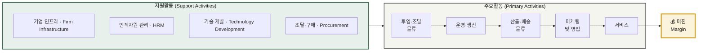
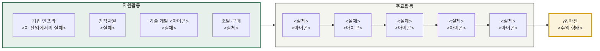
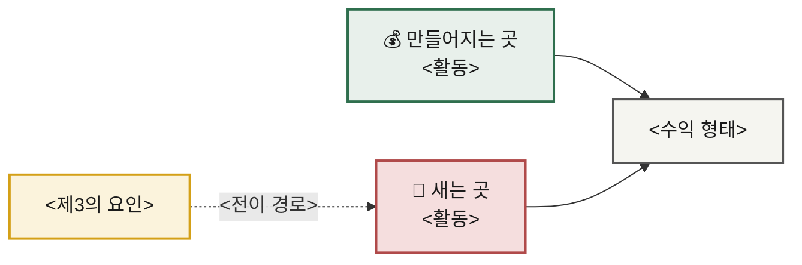

# 02 — 기업 내부 활동의 가치 사슬 분석 방법론

> 본 문서는 앞으로 진행할 모든 가치사슬 분석의 **기준 프레임**입니다.
> 개별 산업 분석은 이 방법론을 그대로 적용해 별도 문서로 작성합니다.

> 📌 **사용 안내** — 아래 질문표는 **특정 산업에 종속되지 않는 공통 질문**으로 구성되어 있습니다.
> 제조·유통·플랫폼·서비스 어떤 업종에도 그대로 적용할 수 있으며, 각 질문의 *대상만* 해당 산업의 투입물·처리과정·전달채널로 바꿔 읽으면 됩니다.
> 각 질문에는 추적용 코드(**설계 D1~D6 / 개선 I1~I6**)를 부여했습니다. 분석 문서에서 이 코드로 어떤 질문에 답했는지 확인할 수 있습니다.

---

## 0. 가치사슬 전체 구조



**분석의 목적** · 기업 활동을 9개로 분해해 **마진이 실제로 어느 활동에서 만들어지는지** 찾아내고, 원가 우위 또는 차별화의 레버를 도출하는 것.

---

## 1. 가치사슬 주요활동 분석

### 1-1. 주요활동 공통 분석 질문표

| 항목명(Activity) | 가치사슬 **설계**를 위한 질문 🏗️ | 가치사슬 **개선**을 위한 질문 🚀 |
| --- | --- | --- |
| **투입·조달 물류**<br>Inbound Logistics<br><br>**핵심 투입자원의 확보와 공급 연결** | **D1** 제품·서비스 제공에 필요한 핵심 투입자원은 무엇인가?<br>**D2** 그 자원을 누구로부터, 어떤 방식으로 확보할 것인가?<br>**D3** 어떤 자원을 자체 확보하고, 어떤 자원을 외부 조달·제휴로 확보할 것인가?<br>**D4** 공급자가 우리와 거래할 유인은 무엇인가?<br>**D5** 투입물의 품질·규격을 어떻게 검수하고 표준화할 것인가?<br>**D6** 투입물을 어떻게 보관·관리하여 운영 단계로 넘길 것인가? | **I1** 투입물의 품질·정확성·적시성을 어떻게 높일 것인가?<br>**I2** 특정 공급자·지역·경로에 대한 의존도를 줄일 수 있는가?<br>**I3** 공급 중단이나 장애에 대비한 대체 경로가 있는가?<br>**I4** 조달 수량과 시점의 예측 정확도를 높일 수 있는가?<br>**I5** 중복 조달·과잉 재고·유휴 자원을 줄일 수 있는가?<br>**I6** 운영 결과 데이터를 조달 의사결정에 다시 반영하고 있는가? |
| **운영·생산**<br>Operations<br><br>**투입물을 고객 가치로 전환** | **D1** 투입물을 고객 가치로 전환하는 핵심 처리 과정은 무엇인가?<br>**D2** 요청 접수부터 결과 산출까지의 흐름을 어떻게 설계할 것인가?<br>**D3** 품질·안전·규정 준수를 어느 단계에서 어떻게 확보할 것인가?<br>**D4** 수요가 급증해도 안정적으로 처리할 수 있는가?<br>**D5** 자동화와 사람의 판단이 담당할 영역의 경계는 어디인가?<br>**D6** 처리 능력의 한계(병목)는 어디에서 발생하는가? | **I1** 단계별 완료율·전환율을 어떻게 높일 것인가?<br>**I2** 고객이 중도 이탈하는 단계와 그 원인은 무엇인가?<br>**I3** 처리시간·오류율·재작업률·수작업 비율을 줄일 수 있는가?<br>**I4** 품질 검증을 강화하면서 처리 속도를 유지할 수 있는가?<br>**I5** 반복 업무를 표준화하거나 자동화할 수 있는가?<br>**I6** 규모가 커질수록 단위 원가가 낮아지는 구조인가? |
| **산출·배송 물류**<br>Outbound Logistics<br><br>**결과물을 고객에게 전달** | **D1** 고객은 결과물을 어떤 경로와 형태로 전달받는가?<br>**D2** 전달 과정의 어느 구간을 직접 수행하고, 어느 구간을 위임할 것인가?<br>**D3** 고객이 현재 상태와 다음 행동을 즉시 이해할 수 있는가?<br>**D4** 채널별(앱·알림·현장·파트너) 역할을 어떻게 구분할 것인가?<br>**D5** 전달의 속도·정확성·비용 중 무엇을 우선할 것인가?<br>**D6** 파트너나 중간 사업자에게 필요한 정보는 어떻게 제공할 것인가? | **I1** 전달 속도·정확도·완료율을 높일 수 있는가?<br>**I2** 전달 실패나 지연이 발생하는 원인과 빈도는 무엇인가?<br>**I3** 위임한 구간의 품질을 어떻게 관리·검증할 것인가?<br>**I4** 지연·장애 시 현재 상태와 조치를 선제적으로 안내할 수 있는가?<br>**I5** 과도하거나 중복된 안내를 줄일 수 있는가?<br>**I6** 전달 1건당 원가를 낮출 구조적 방법이 있는가? |
| **마케팅 및 영업**<br>Marketing & Sales | **D1** 우리의 핵심 고객은 누구이며, 여러 고객군 중 무엇을 우선할 것인가?<br>**D2** 고객이 우리를 선택해야 하는 핵심 이유는 무엇인가?<br>**D3** 가격·품질·편의·신뢰 중 무엇을 전면에 내세울 것인가?<br>**D4** 어떤 채널로 고객에게 도달할 것인가?<br>**D5** 첫 거래 이후 어떤 다음 거래로 연결할 것인가?<br>**D6** 파트너·중간 사업자는 어떤 방식으로 유치할 것인가? | **I1** 고객획득비용(CAC)을 낮추고 고객생애가치(LTV)를 높일 수 있는가?<br>**I2** 프로모션이 끝난 뒤에도 고객이 남는가?<br>**I3** 유료 채널 의존도를 줄이고 자연 유입을 늘릴 수 있는가?<br>**I4** 재구매율과 이용 빈도를 높일 수 있는가?<br>**I5** 개인화·추천이 실제 고객 편익과 매출로 이어지는가?<br>**I6** 마케팅 활동이 다른 활동(운영·물류)의 효율에도 기여하는가? |
| **서비스**<br>Service<br><br>**거래 이후 지원과 고객 보호** | **D1** 거래 이후 발생할 수 있는 문제 유형은 무엇인가?<br>**D2** 각 문제를 누가, 어떤 기준으로 처리할 것인가?<br>**D3** 고객이 스스로 해결할 수 있는 범위는 어디까지인가?<br>**D4** 자동 응대와 담당자 개입의 경계는 어디인가?<br>**D5** 보상·환불·재처리의 기준과 한도는 무엇인가?<br>**D6** 고객 의견(VOC)을 제품·운영 개선으로 연결하는 경로가 있는가? | **I1** 반복 문의를 앞단 활동의 개선으로 제거할 수 있는가?<br>**I2** 문제를 고객 문의 이전에 선제적으로 탐지할 수 있는가?<br>**I3** 문제의 원인을 활동·공정·담당 단위로 특정할 수 있는가?<br>**I4** 처리 시간이 아니라 실제 해결률과 재발률을 측정하고 있는가?<br>**I5** 응대 채널이 바뀌어도 고객 맥락이 유지되는가?<br>**I6** 서비스 비용 중 구조적인 것과 제거 가능한 것을 구분하고 있는가? |

---

## 2. 가치사슬 지원활동 분석

### 2-1. 지원활동 공통 분석 질문표

| 항목명(Activity) | 가치사슬 **설계**를 위한 질문 🏗️ | 가치사슬 **개선**을 위한 질문 🚀 |
| --- | --- | --- |
| **기업 인프라**<br>Firm Infrastructure | **D1** 사업을 수행할 법인·조직 구조를 어떻게 구성할 것인가?<br>**D2** 사업 부문 간 책임·데이터·브랜드의 경계는 어디인가?<br>**D3** 경영진·재무·법무·리스크·감사의 역할은 무엇인가?<br>**D4** 해당 산업의 규제와 인허가 요건을 어떻게 반영할 것인가?<br>**D5** 신규 사업·서비스의 검토와 승인 절차는 무엇인가?<br>**D6** 대규모 투자(설비·인수·신규 진출)의 판단 기준은 무엇인가? | **I1** 조직이 늘어나면서 책임 소재가 흐려지고 있지 않은가?<br>**I2** 성장 지표와 리스크·수익성 지표가 충돌할 때의 판단 기준은 무엇인가?<br>**I3** 사업 단위(지역·부문·채널)별 손익을 개별적으로 파악할 수 있는가?<br>**I4** 사고·장애 발생 시 대응 지휘체계가 명확한가?<br>**I5** 규제 변화를 조기에 감지하고 반영하는 체계가 있는가?<br>**I6** 관리 비용이 사업 규모에 비해 과도하게 늘고 있지 않은가? |
| **인적자원 관리**<br>Human Resource Management | **D1** 각 활동에 필요한 핵심 인재와 역량은 무엇인가?<br>**D2** 어떤 역량을 내부에 두고, 어떤 역량을 외부에서 조달할 것인가?<br>**D3** 속도와 안정성 중 어느 쪽에 조직 운영을 맞출 것인가?<br>**D4** 의사결정 권한과 최종 책임은 누구에게 있는가?<br>**D5** 현장 인력의 확보·교육·유지 방식은 무엇인가?<br>**D6** 조직 문화에 무엇을 내재화할 것인가? | **I1** 인력 이탈률이 원가와 품질에 미치는 영향을 파악하고 있는가?<br>**I2** 성과 평가가 매출뿐 아니라 품질·안전·협업을 반영하는가?<br>**I3** 특정 인력에게 지식과 권한이 집중되어 있지 않은가?<br>**I4** 조직이 커져도 의사결정 속도를 유지할 수 있는가?<br>**I5** 숙련도 향상이 실제 생산성 지표로 이어지는가?<br>**I6** 고강도 업무의 번아웃과 안전을 관리하고 있는가? |
| **기술 개발**<br>Technology Development | **D1** 핵심 경쟁력을 만드는 기술은 무엇인가?<br>**D2** 그 기술은 **매출을 만드는가, 원가를 줄이는가?**<br>**D3** 자체 개발과 외부 솔루션 도입의 기준은 무엇인가?<br>**D4** 서비스를 확장하면서 기술적 결합도를 낮출 수 있는가?<br>**D5** 요구되는 보안·가용성·복구 수준은 어디까지인가?<br>**D6** 데이터·모델·프로세스를 어떻게 자산으로 축적할 것인가? | **I1** 중복 개발을 줄이고 공통 자산의 재사용률을 높일 수 있는가?<br>**I2** 장애나 품질 저하를 사전에 예측하고 자동 복구할 수 있는가?<br>**I3** 개선 속도와 운영 안정성을 동시에 확보할 수 있는가?<br>**I4** 모델·알고리즘의 오류와 편향을 관리하는 체계가 있는가?<br>**I5** 기술 투자 효과를 어떤 지표로 검증하고 있는가?<br>**I6** 기술 변경이 파트너·고객에게 전가하는 비용을 최소화할 수 있는가? |
| **조달·구매**<br>Procurement | **D1** 사업 운영에 필요한 자원·설비·솔루션은 무엇인가?<br>**D2** 공급자를 가격 외에 어떤 기준으로 평가할 것인가?<br>**D3** 핵심 공급자에 대한 협상력을 어떻게 확보할 것인가?<br>**D4** 공급자 장애나 계약 종료 시에도 사업을 지속할 수 있는가?<br>**D5** 외부 업체가 다루는 정보·자산을 어떻게 통제할 것인가?<br>**D6** 구매를 한곳에 집중할 것인가, 분산할 것인가? | **I1** 구매 규모 증가에 따라 단가와 계약 조건을 개선할 수 있는가?<br>**I2** 특정 공급자나 기술에 과도하게 종속되어 있지 않은가?<br>**I3** 핵심 공급자에 대한 대안과 전환 계획이 있는가?<br>**I4** 계약에 품질·보안·장애 대응·해지 조건이 포함되어 있는가?<br>**I5** 공급자의 재무·품질·규제 위험을 지속적으로 모니터링하는가?<br>**I6** 단위 원가에 직접 반영되는 구매 항목을 별도로 관리하는가? |

> 💡 **주요활동의 '투입·조달 물류'와 지원활동의 '조달·구매'는 다릅니다.**
> 전자는 **판매할 제품·서비스를 이루는 투입물**을, 후자는 **사업 운영에 필요한 자원**(설비·솔루션·소모품)을 다룹니다.

---

## 📋 분석 실행 체크리스트

- [ ] **0. 대상 정의** — 어느 기업/사업 모델의 가치사슬인지 경계를 긋는다
- [ ] **1~5. 주요활동 분해** — 각 활동에서 *실제로 무슨 일이 일어나는가* 를 먼저 서술
- [ ] **6~9. 지원활동 분해** — 주요활동을 떠받치는 방식으로 서술
- [ ] **10. 마진 기여도 평가** — 각 활동이 마진을 *만드는가 / 쓰는가*
- [ ] **11. 병목·취약 지점 식별** — 통제하지 못하는 활동은 어디인가
- [ ] **12. 개선 레버 도출** — 설계🏗️와 개선🚀 관점을 구분해 제안

### 활동별 마진 기여도 표기 기준

| 표기 | 의미 |
|:--:|---|
| 💰 **가치 창출** | 이 활동이 차별화 또는 프리미엄의 원천 — 투자 대상 |
| ⚙️ **가치 전달** | 필수적이나 그 자체로 차별화되지 않음 — 효율화 대상 |
| 💸 **비용 중심** | 원가를 소모 — 축소·자동화·외주 검토 대상 |
| ⚠️ **통제 불가** | 가치사슬 밖의 주체에게 위임된 구간 — 리스크 관리 대상 |

> ⚠️ **주의** — 가치사슬 분석은 *활동을 나열하는 것* 이 목적이 아닙니다.
> **"마진이 어디서 만들어지고 어디서 새는가"** 에 답하지 못하면 분석이 끝난 것이 아닙니다.

---

# 📄 산출물 규격 (Output Specification)

> 이 장은 **이 방법론을 다시 사용했을 때 동일한 수준의 결과물이 재현되도록** 하는 지시문입니다.
> 아래 구성요소는 **선택이 아니라 필수**입니다. 하나라도 빠지면 분석이 완료된 것으로 보지 않습니다.

## 3. 파일 구성

한 챕터의 산출물은 **방법론 1 + 분석 N + 비교 1** 로 구성합니다.

```
0X-<chapter-slug>/
├── methodology.md                    # 본 문서 (기준 프레임)
├── analysis-01-<market-slug>.md      # 분석 대상 ①
├── analysis-02-<market-slug>.md      # 분석 대상 ②
└── comparison.md                     # 대상 간 비교 (분석이 2개 이상일 때 필수)
```

- 파일명은 **영문 소문자 kebab-case**로 통일합니다.
- 분석 대상이 1개면 `comparison.md`는 생략합니다.
- 상단 인용구에 **방법론 · 선행 챕터 · 비교 대상**의 상호 링크를 반드시 넣습니다.

---

## 4. 분석 문서(analysis-*.md) 필수 구성요소

| # | 구성요소 | 형식 | 비고 |
|:--:|---|---|---|
| ① | **문서 헤더 인용구** | 인용구 | 적용 방법론 링크 + 선행 챕터 분석 링크 + 비교 대상 링크 |
| ② | **0. 분석 대상 정의** | 표 | `대상` / `가치사슬의 특이점` / `선행 챕터 연계` 3행 이상 |
| ③ | **가치사슬 전체 구조도** | Mermaid `flowchart LR` | **§0 대상 정의 직후 배치.** 지원활동 subgraph + 주요활동 subgraph + 마진 노드. **각 활동 노드에 기여도 아이콘(💰⚙️💸⚠️) 표기** |
| ④ | **1. 주요활동 분석** (5개) | 활동별 소제목 | 아래 §4-1 세부 규격 준수 |
| ⑤ | **2. 지원활동 분석** (4개) | 활동별 요약표 | `설계 🏗️` / `개선 🚀` 2행. 셀 안에 질문 코드 인라인 표기 |
| ⑥ | **3. 마진 발생 지점 종합** | 표 + Mermaid + 한 줄 요약 | 9개 활동 전체의 기여도 판정표 → 마진 흐름 다이어그램 → **"한 줄 요약"** 문장 |
| ⑦ | **4. 개선 우선순위** | 표 | `순위`/`과제`/`대상 활동 (질문 코드)`/`기대 효과`. **5개 이상** |
| ⑧ | **📎 검증이 필요한 항목** | 체크박스 목록 | 미검증 수치를 여기에 모음. **5개 이상** |

### 4-1. 주요활동 5개의 세부 규격

각 활동마다 **아래 4개 블록을 순서대로** 작성합니다.

| 블록 | 형식 | 규격 |
|---|---|---|
| **활동명 헤더** | `### 1-N. <활동명> — **<이 산업에서의 실체>** <기여도 아이콘>` | 실체는 산업 용어로 구체화 (예: "투입·조달 물류 — **산지 매입·콜드체인 입고** 💰") |
| **도입 인용구** | 인용구 1~2문장 | 이 활동이 **이 산업에서 왜 그런 성격을 갖는지** 한 문장으로 못 박기 |
| **설계 🏗️** | 표 `공통 질문 \| 이 산업에서의 답` | **D1~D6 전부 6행.** 질문 코드를 굵게 표기하고 질문 요지를 함께 씀 |
| **개선 🚀** | 표 `공통 질문 \| 이 산업에서의 과제` | **I1~I6 전부 6행.** 동일 형식 |

- 표 아래에 **추가 레버**나 **핵심 판단**을 인용구/불릿으로 보충할 수 있습니다(선택).
- 처리 흐름이 복잡한 활동은 **Mermaid `flowchart LR` 공정도**를 추가합니다(권장).
- 선행 챕터(Five Forces 등)와 연결되는 지점은 `> 📌 **<챕터명> 연결**` 인용구로 명시합니다.

> ⚠️ **D1~D6 / I1~I6을 임의로 생략하지 마십시오.** 해당 산업에 적용되지 않는 질문이라면
> "해당 없음 — <이유>"라고 **명시적으로** 적습니다. 빈칸으로 두면 비교 단계에서 대조가 깨집니다.

---

## 5. 비교 문서(comparison.md) 필수 구성요소

| # | 구성요소 | 형식 | 비고 |
|:--:|---|---|---|
| ① | **0. 이 비교의 위치** | 표 | 선행 챕터 결론과 이번 챕터가 무엇을 다르게 묻는지 대조 |
| ② | **1. 9개 활동 나란히 보기** | 표 | `활동`/`대상A`/`대상B`/`무엇이 갈랐나` 4열 × 9행 |
| ③ | **1-1. 같은 질문, 다른 답** | 표 | `활동·질문코드`/`공통 질문`/`대상A 답`/`대상B 답`. **답이 갈린 질문만** 추림 |
| ④ | **2~N. 핵심 발견** | 소제목 + Mermaid | **3개 이상.** 각 발견은 *현상 → 메커니즘 → 일반화된 원칙* 순서 |
| ⑤ | **원가 구조 비교** | 표 | 매출원가·원가 성격·확장 시 비용·손익분기 조건·개선 레버 |
| ⑥ | **선행 챕터 ↔ 이번 챕터 연결** | 표 + Mermaid | 앞 챕터에서 찾은 약점을 **이번 챕터의 어느 항목이 해결하는지** 매핑 |
| ⑦ | **종합 결론** | 표 + 번호 목록 | 관점별 대조표 + **"이번 분석에서 얻은 판단 원칙" 5개 이상** |
| ⑧ | **📎 다음 단계 제안** | 체크박스 목록 | 다음 챕터로 넘길 과제 |

---

## 6. 표기 규약

### 6-1. 기여도 아이콘

§ 활동별 마진 기여도 표기 기준(위)의 💰 ⚙️ 💸 ⚠️ 를 **전체 구조도 · 활동 헤더 · 종합표 세 곳에서 일관되게** 사용합니다.

### 6-2. 질문 코드

- 본문 표에서 `**D3**`, `**I4**` 형태로 **굵게** 표기
- 개선 우선순위 표의 `대상 활동` 열에는 `조달 **D4·I2**` 처럼 활동명과 함께 표기

### 6-3. Mermaid 색상 토큰

다크/라이트 모드 모두에서 읽히도록 **아래 5종만** 사용합니다. `color:#1a1a1a`는 항상 붙입니다.

| 용도 | 스타일 |
|---|---|
| 기본·긍정 (지원활동, 가치 창출) | `fill:#E8F0EB,stroke:#2F6F4E,stroke-width:2px,color:#1a1a1a` |
| 강조·주목 (핵심 지점, 마진) | `fill:#FBF3DC,stroke:#D4A017,stroke-width:2px,color:#1a1a1a` |
| 경고·손실 (비용 누수) | `fill:#F5DEDE,stroke:#B04A4A,stroke-width:2px,color:#1a1a1a` |
| 중립 (주요활동 묶음, 결과) | `fill:#F5F5F0,stroke:#555,stroke-width:2px,color:#1a1a1a` |
| 최상위 강조 (마진 노드) | 위 강조 토큰 + `stroke-width:3px` |

### 6-4. 인용구 용도

| 표기 | 용도 |
|---|---|
| `> 📌` | 선행 챕터·타 활동과의 연결 지점 |
| `> 💡` | 학습 포인트 · 일반화 가능한 통찰 |
| `> ⚠️` | 주의·리스크·해석 오류 경고 |

---

## 7. 작성 원칙 (사실성)

1. **수치를 지어내지 않습니다.** 확인되지 않은 시장 규모·점유율·비율은 본문에 쓰지 말고 **📎 검증이 필요한 항목**으로 내립니다.
2. 분석의 기본 단위는 **구조와 메커니즘**입니다. "왜 그렇게 되는가"를 설명하지 못하는 서술은 넣지 않습니다.
3. 특정 기업의 내부 지표를 아는 것처럼 쓰지 않습니다. 필요하면 *"~한 구조에서는 일반적으로"* 로 한정합니다.
4. 각 활동의 결론은 **마진 기여도 판정(💰⚙️💸⚠️)으로 수렴**해야 합니다. 판정 없는 서술은 분석이 아니라 설명입니다.

---

## 8. 분석 문서 템플릿

> 새 분석을 시작할 때 아래를 복사해 채웁니다.

````markdown
# 가치사슬 분석 ① — <대상 시장명>

> **적용 방법론** · [가치사슬 분석 방법론](./methodology.md) — 공통 질문표의 **설계 D1~D6 / 개선 I1~I6** 코드를 그대로 따릅니다.
> **선행 분석** · [<선행 챕터> — <대상>](../0X-<slug>/analysis-01-<slug>.md)
> **비교 대상** · [분석 ② <대상>](./analysis-02-<slug>.md) · [종합 비교](./comparison.md)

---

## 0. 분석 대상 정의

| 항목 | 내용 |
|---|---|
| **대상** | <사업 모델 한 문장 정의> |
| **가치사슬의 특이점** | <이 산업 가치사슬이 일반과 다른 점> |
| **<선행 챕터> 연계** | <앞 챕터에서 확인된 구조적 약점> |

### 가치사슬 전체 구조



---

## 1. 주요활동 분석

### 1-1. 투입·조달 물류 — **<이 산업에서의 실체>** <아이콘>

> <이 활동이 이 산업에서 갖는 성격을 못 박는 한 문장>

#### 설계 🏗️

| 공통 질문 | 이 산업에서의 답 |
|---|---|
| **D1** 핵심 투입자원 | |
| **D2** 확보 경로 | |
| **D3** 자체 vs 외부 | |
| **D4** 공급자의 참여 유인 | |
| **D5** 품질 검수·표준화 | |
| **D6** 보관·운영 인계 | |

#### 개선 🚀

| 공통 질문 | 이 산업에서의 과제 |
|---|---|
| **I1** 투입물 품질·적시성 | |
| **I2** 의존도 축소 | |
| **I3** 공급 중단 대비 | |
| **I4** 예측 정확도 | |
| **I5** 중복·유휴 축소 | |
| **I6** 운영 데이터 환류 | |

<!-- 1-2 운영·생산 / 1-3 산출·배송 물류 / 1-4 마케팅 및 영업 / 1-5 서비스 — 동일 구조 반복 -->

---

## 2. 지원활동 분석

### 2-1. 기업 인프라 <아이콘>

| 구분 | 내용 |
|---|---|
| **설계 🏗️** | **D1** … · **D4** … · **D6** … |
| **개선 🚀** | **I3** … · **I5** … |

<!-- 2-2 인적자원 관리 / 2-3 기술 개발 / 2-4 조달·구매 — 동일 구조 -->

---

## 3. 마진 발생 지점 종합

| 활동 | 기여도 | 근거 |
|---|:--:|---|
| <9개 활동 전부> | | |

### 결론 — 마진이 만들어지는 곳과 새는 곳



**한 줄 요약** — 마진은 **<X>** 에서 만들어지고, **<Y>** 에서 샙니다.

---

## 4. 개선 우선순위

| 순위 | 과제 | 대상 활동 (질문 코드) | 기대 효과 |
|:--:|---|---|---|
| 1 | | | |

---

## 📎 검증이 필요한 항목

- [ ] <미검증 수치 항목>
````

---

## 9. 완료 판정 체크리스트

아래를 **모두** 만족해야 산출물이 완료된 것으로 봅니다.

- [ ] 분석 문서에 **가치사슬 전체 구조도**가 있고, 모든 활동 노드에 기여도 아이콘이 붙어 있다
- [ ] 주요활동 5개 각각에 **D1~D6 6행 + I1~I6 6행** 표가 모두 있다 (해당 없으면 사유 명시)
- [ ] 지원활동 4개 모두 설계🏗️/개선🚀 2행 표가 있다
- [ ] **9개 활동 전부**에 마진 기여도 판정(💰⚙️💸⚠️)이 부여되었다
- [ ] **마진 흐름 다이어그램**과 **"한 줄 요약"** 문장이 있다
- [ ] 개선 우선순위가 5개 이상이고, 각 항목에 **근거 질문 코드**가 붙어 있다
- [ ] 검증이 필요한 항목이 5개 이상이고, **본문에 미검증 수치가 남아 있지 않다**
- [ ] 선행 챕터와의 연결 지점이 `> 📌` 인용구로 최소 1회 이상 명시되었다
- [ ] (분석 2개 이상) 비교 문서에 **§1 9개 활동 대조 · §1-1 같은 질문 다른 답 · 핵심 발견 3개 이상 · 판단 원칙 5개 이상**이 있다
- [ ] Mermaid 색상이 §6-3의 5종 토큰만 사용했다
