# 개인카페 통합 리워드 서비스의 가치사슬 분석

> **분석 프레임:** 본 폴더 `methodology.md`의 주요활동 5개 · 지원활동 4개 질문표
> **입력 자료:** `01-porters-five-forces/five-forces-analysis.md`(산업 정의 B · 집중화 전략) · `01-porters-five-forces/business-one-pager.md` · `00-아이디에이션/개인카페_통합스탬프_서비스기획.md`
> **작성일:** 2026-08-13
> **표기 규약:** ⚠️ 는 실측·검증 전 수치입니다.

---

## 0. 분석 설계 — 무엇을 깊게 볼 것인가

### 0-1. Five Forces에서 이어받는 세 가지 제약

가치사슬 분석은 **앞선 산업 분석의 결론을 내부 활동으로 번역하는 작업**입니다. 따라서 다음 세 가지를 전제로 시작합니다.

| 이어받는 결론 | 가치사슬에 부과하는 제약 |
|---|---|
| **산업 정의 = 개인카페의 고객 획득 지출 시장** | 우리가 파는 것은 리워드 시스템이 아니라 **검증된 신규 고객 접점**입니다. 모든 활동은 "성과를 증명하는가"로 평가됩니다. |
| **전략 = 집중화(상권 단위 국소 독점)** | 활동의 설계 단위가 '전국'이 아니라 **'상권 1개'** 입니다. 모든 원가·성능 지표를 상권 단위로 측정합니다. |
| **현 수익 모델로는 마진이 성립하지 않음** (SOM 전체 점령 시에도 ⚠️연 2.6억원) | 주요활동을 **마진 센터가 아니라 데이터 수집 인프라**로 설계해야 합니다. §3에서 다시 다룹니다. |

### 0-2. 설계 🏗️ 와 개선 🚀 를 어떻게 나눠 답했는가

방법론 §3에 따르면 설계 질문은 활동이 아직 없을 때, 개선 질문은 이미 돌아가는 활동에 씁니다. **본 사업은 실측 0건으로, 돌아가는 활동이 하나도 없습니다.** 따라서 개선 질문을 그대로 답하면 근거 없는 상상이 됩니다.

> **처리 방식:** 설계 🏗️ 는 정면으로 답하고, 개선 🚀 는 **"첫 파일럿에서 무엇을 계측해 무엇을 고칠지"** 로 변환해 답합니다. 즉 개선 항목은 결론이 아니라 **계측 설계**입니다.

### 0-3. 원가·차별화 지도 — 분석 깊이 배분

방법론 §3은 "원가 비중이 크거나 차별화가 일어나는 활동에 집중"하라고 규정합니다. 그 지도를 먼저 그립니다.

| 활동 | 원가 비중 | 차별화 기여 | 분석 깊이 |
|---|:--:|:--:|:--:|
| **투입·조달 물류** (상권 커버리지 확보) | 🔴 **최대** | 🔴 **최대** | **심층** |
| **운영·생산** (도장→완주→쿠폰→정산) | 🟢 낮음 | 🔴 **최대** | **심층** |
| **산출·배송 물류** (고객·점주 전달) | 🟢 낮음 | 🔴 **높음** | **심층** |
| 마케팅·영업 | 🟡 중간(공급측만) | 🟡 중간 | 중간 |
| 서비스 | 🟡 중간 | 🟡 중간 | 중간 |
| 기술 개발 | 🟡 중간 | 🔴 **높음**(장기 해자) | 중간 |
| 기업 인프라 | 🟢 낮음 | 🟡 규제 통과 조건 | 요약 |
| 인적자원 관리 | 🔴 **높음**(영업 인건비) | 🟢 낮음 | 요약 |
| 조달·구매 | 🟢 낮음 | 🟢 낮음 | 요약 |

### 0-4. 이 사업 가치사슬의 구조적 특이점 세 가지 ★

일반적인 가치사슬 교과서 구조가 이 사업에서는 **세 지점에서 어긋납니다.** 이것을 먼저 인식하지 않으면 9개 활동을 형식적으로 채우게 됩니다.

- **① 조달과 영업이 같은 활동입니다.** 점주는 리워드 재고를 공급하는 **공급자**이면서 마케팅 예산을 집행하는 **구매자**입니다(Five Forces §0). 따라서 "카페를 확보하는 일"은 조달(§1-1)이면서 동시에 영업(§1-4)이며, 두 활동의 원가가 하나의 인건비로 합쳐집니다.
- **② 투입물의 단위가 '개수'가 아니라 '밀도'입니다.** 카페 25곳이 전국에 흩어져 있으면 제품 가치는 0이고, 한 상권에 모여 있으면 작동합니다. 재고를 쌓는 조달이 아니라 **임계 밀도를 채우는 조달**입니다.
- **③ 리워드 원가가 0원이어서, 운영 활동이 마진을 만들지 않습니다.** 쿠폰 3,000원은 도장을 찍은 12곳이 250원씩 부담하고 플랫폼 수수료는 0%입니다. 즉 **주요활동 전체가 통과 구조**이며, 마진은 별도 계층에서 발생합니다(§3).

### 0-5. 가치사슬 전체 구조

```mermaid
flowchart LR
    subgraph SUP["지원활동"]
        direction TB
        S1["기업 인프라<br/>규제·법인 · 요약"]
        S2["인적자원<br/>상권 영업 인력 · 원가🔴"]
        S3["기술 개발<br/>방문 동선 데이터 · 해자🔴"]
        S4["조달·구매<br/>채널 종속 위험 · 요약"]
    end

    A["투입·조달<br/>상권 커버리지 60%<br/>원가🔴 차별화🔴"]
    B["운영·생산<br/>도장→완주→쿠폰→정산<br/>차별화🔴"]
    C["산출·배송<br/>고객: 다음 카페<br/>점주: 월 정산서<br/>차별화🔴"]
    D["마케팅·영업<br/>수요측 CAC≈0<br/>공급측=조달과 동일"]
    E["서비스<br/>정산 분쟁·폐업 처리"]
    M(["마진<br/>주요활동에서<br/>발생하지 않음"])

    A --> B --> C --> D --> E --> M
    SUP -.-> A
    SUP -.-> B
    SUP -.-> C

    style A fill:#F6E3E3,stroke:#B23A3A,stroke-width:3px,color:#1a1a1a
    style B fill:#F6E3E3,stroke:#B23A3A,stroke-width:3px,color:#1a1a1a
    style C fill:#F6E3E3,stroke:#B23A3A,stroke-width:2px,color:#1a1a1a
    style D fill:#FBF3DC,stroke:#D4A017,stroke-width:2px,color:#1a1a1a
    style E fill:#FBF3DC,stroke:#D4A017,stroke-width:2px,color:#1a1a1a
    style M fill:#E8F0EB,stroke:#2F6F4E,stroke-width:2px,color:#1a1a1a
```



---
---

# PART 1 · 주요활동 분석

## 1-1. 투입·조달 물류 — 상권 커버리지 확보 🔴 원가 최대 · 차별화 최대

> **한 줄 요약:** 이 사업의 진짜 공장은 서버가 아니라 **상권 영업**입니다. 원가의 대부분과 진입 장벽의 전부가 이 활동에 있습니다.

### 설계 🏗️

| 질문 | 이 사업에서의 답 |
|---|---|
| **핵심 투입자원은 무엇인가** | 원자재가 아닌 세 가지 무형 자원입니다. ① **점주의 도장 발행 승낙**(= 250원 분담 동의) ② **상권 내 참여 밀도**(최소 25곳 · 커버리지 60%) ③ **고객의 방문 행동 데이터**. 이 중 ②가 제품 성능을 직접 결정합니다. |
| **어떤 경로·조건으로 확보하는가** | 3단계로 나눕니다. **1단계 직접 영업**(상권 1호점 ~ 임계점, 창업자가 직접) → **2단계 셀프 온보딩**(임계 통과 후, 참여 카페의 추천이 채널) → **3단계 지역 파트너**(상권 복제 국면). 조건은 초기 3개월 구독 무료 + 도장 청구는 완주 시점에만 발생. |
| **파트너와 어떤 방식으로 연결하는가** | 가맹계약이 아닌 **제휴 계약**입니다. Five Forces §1의 규제 검토 결론에 따라 '가맹점'이 아닌 '제휴점'임을 계약 문구에서 명확히 구분해야 합니다(가맹사업법 회피). 지분투자·장기계약은 8만개 파편화 시장에서 단위 비용이 성립하지 않습니다. |
| **무엇을 자체 확보하고 무엇을 외부 조달하는가** | **자체:** 상권 1호점부터 임계점까지의 영업. 이 구간의 설득 논리가 곧 제품 가설이므로 외주가 불가능합니다. **외부:** 임계 통과 후의 확장 영업, 상권 데이터(상권정보시스템·공공데이터). |
| **투입물을 어떻게 검수·표준화하는가** | 카페 품질이 곧 리워드 품질입니다. 최소 등록 기준이 필요합니다 — **3,000원을 초과하는 음료가 메뉴에 있는가**(없으면 쿠폰 사용 시 차액 결제가 발생하지 않아 쿠폰 카페의 이익이 +4,200원 → +2,200원으로 축소), 영업시간·좌석·위치 좌표의 정확성. 기준 미달 카페는 완주 경로를 오염시킵니다. |
| **파트너가 우리와 거래할 유인은 무엇인가** | 도장 손님 1명당 실부담 **52원**과, 도장을 찍는 즉시 받는 **알림 발송권·홈 노출 가중·손님 분석** 3종입니다. |

> ⚠️ **설계 공백 — '1호점 문제'.** 위 유인은 **밀도가 이미 있을 때만 성립합니다.** 참여 카페가 3곳인 상권에서는 완주가 불가능하므로 점주에게 약속할 수 있는 것이 아무것도 없습니다. 즉 **조달 활동의 첫 25곳은 제품 가치 없이 설득해야 합니다.**
> 대응 선택지: ① 브랜드 협찬으로 리워드 재원을 플랫폼이 부담(카페 부담 0, 지속성 없음) ② 종이 카드 컨시어지로 "실측 참여" 프레이밍 ③ 초기 25곳에 영구 무료·발언권 부여. **이 셋 중 무엇을 택할지가 조달 활동의 최우선 미결 항목입니다.**

### 개선 🚀 — 파일럿에서 계측할 것

- **상권당 온보딩 단위비용** = 영업 방문 횟수 × 소요 시간 × 전환율. 이것이 이 사업의 **실질 CAC**입니다(수요측 CAC는 0에 수렴하므로 §1-4 참조). 상권 1개를 임계까지 채우는 총비용을 모르면 확장 계획을 세울 수 없습니다.
- **이탈 보충률** — 개인카페 3년 생존율 53.2%는 커버리지가 **가만히 두면 감소한다**는 뜻입니다. 커버리지 60%를 유지하기 위해 연간 몇 곳을 새로 확보해야 하는지가 상시 러닝 코스트입니다.
- **개점 시점 타겟팅 효율** — 신규 개점 매장은 고객 확보가 절실하므로 전환율이 높을 것으로 가정됩니다. ⚠️ 미검증. 개점 3개월 이내 매장의 전환율을 별도 집계해야 합니다.
- **지역 의존도** — 집중화 전략은 정의상 단일 상권 집중이며, 이는 **단일 상권 실패 = 전체 실패**를 뜻합니다. 2개 상권 병행이 위험 분산인지 자원 분산인지는 상권당 온보딩 비용이 나온 뒤에만 판단 가능합니다.
- **되먹임 설계** — 도장 발행량 상위 카페의 공통 속성(입지·메뉴 가격대·좌석 수·SNS 팔로워)을 프로파일로 만들어 **다음 상권의 우선 타겟 리스트**로 씁니다. 조달 데이터가 조달 효율을 개선하는 유일한 자기강화 루프입니다.

---

## 1-2. 운영·생산 — 도장에서 정산까지의 변환 엔진 🔴 차별화 최대

> **한 줄 요약:** 이 활동의 성능은 단 하나의 숫자, **완주율**로 수렴합니다. 나머지는 모두 그 숫자를 지키는 장치입니다.

### 설계 🏗️

**핵심 변환 과정 — 가치가 실제로 생성되는 지점은 '완주' 하나입니다.**

```
방문 → 도장 적립(QR) → [서로 다른 카페 12곳] → 쿠폰 3,000원 생성 → 사용 → 월 1회 순액 정산
                            ↑                           ↑
                   여기까지는 전부 '재고'        여기서 처음 가치가 발생하고
                   (청구도 발생하지 않음)        동시에 청구가 발생한다
```

| 질문 | 이 사업에서의 답 |
|---|---|
| **핵심 공정의 순서와 방식** | 도장은 **같은 카페 중복 불인정**(서로 다른 12곳이 조건), 유효기간 1년·선입선출 소멸(스타벅스 별 규칙 준용), 쿠폰은 유효기간 10일. 청구는 **12칸 완성으로 쿠폰이 생기는 순간**에만 발생하고 미완주 도장은 청구하지 않습니다. |
| **품질·규제 검증 지점** | 가장 중요한 검증은 **"도장이 실제 방문의 증빙인가"** 입니다. 부정 적립이 발생하면 정산의 근거가 무너지고, 정산 신뢰가 무너지면 조달(§1-1)이 즉시 붕괴합니다. **위치 검증 + 점주 단말 승인의 이중 확인**이 최소 설계입니다. |
| **수요 급증 대응** | 트래픽 부하는 이 사업의 문제가 아닙니다(상권 30곳 규모). 진짜 급증 리스크는 **쿠폰 동시 완주로 인한 청구 폭증**입니다. 특정 달에 완주가 몰리면 점주 월 정산 순액이 예상보다 크게 마이너스로 튀고, 이는 해지 트리거가 됩니다. **점주별 월 청구 상한**을 설계할지 여부를 결정해야 합니다. |
| **자동화와 사람의 경계** | 정산 계산·청구·이체는 전자동. **부정 적립 판정과 정산 이견 조정은 사람**이 개입합니다. 자동 판정이 정상 손님을 부정으로 오판하면 점주 신뢰가 1건으로 무너지기 때문입니다. |

### 개선 🚀 — 파일럿에서 계측할 것

- **완주율(12칸 도달률) = 이 활동의 유일한 성능 지표.** ⚠️가정 20%이며, 단위 경제 전체가 이 값 위에 서 있습니다. 미달 시 12곳 → 10곳(도장당 300원)으로 하향하지만, **완주는 쉬워지고 카페 부담은 오히려 커지는 교환**임을 감수하는 선택입니다.
- **이탈 단계 특정** — 미완주자가 평균 4개를 모은다는 ⚠️가정에서 완주 기여율 43%가 도출되었습니다. 실제 병목이 4→12 구간이라면, 개선 레버는 리워드 크기가 아니라 **중간 마일스톤**(6칸 시점의 소형 보상)입니다. 몇 번째 칸에서 멈추는지를 반드시 칸 단위로 집계해야 합니다.
- **1년 만료가 저빈도 사용자를 배제하는가** — 완주 예상 기간이 약 3개월이므로 1년은 4배 여유로 설계되었으나, 월 1회 이하 방문자에게는 12곳이 1년을 초과합니다. 만료로 인한 이탈이 발생하는지 확인이 필요합니다.
- **부정 적립 검출력 vs 오탐률** — 검출을 강화하면 정상 적립이 거부되고, 완화하면 정산 신뢰가 무너집니다. **오탐 1건의 비용이 미검출 1건의 비용보다 크다**는 전제로 임계값을 잡되, 그 전제를 파일럿에서 확인해야 합니다.
- **수작업 제거** — 종이 카드 컨시어지 단계의 수작업(도장 확인·집계)은 의도된 것입니다. 이 단계에서 **어떤 수작업이 반복되는지**가 자동화 우선순위의 근거가 됩니다.

---

## 1-3. 산출·배송 물류 — 두 수신자에게 서로 다른 것을 전달한다 🔴 차별화 높음

> **한 줄 요약:** 이 활동은 통상 저평가되지만, 이 사업에서는 **점주 리텐션의 유일한 장치**가 여기 있습니다. 월 정산서가 청구서로 읽히면 해지, 성과 보고서로 읽히면 유지입니다.

### 설계 🏗️ — 수신자별로 전달물이 완전히 다릅니다

| 수신자 | 전달 채널 | 전달물 | 전달 시점에 반드시 함께 줄 정보 |
|---|---|---|---|
| **고객** | 앱 | 도장 적립 확인 · 쿠폰 · 남은 칸 수 | **"다음에 갈 카페"** — 현재 상태(8/12)와 다음 행동이 한 화면에 있어야 합니다. 이 화면이 곧 완주율 레버입니다. |
| **점주** | 점주 앱 · 문자 | **월 정산서** · 알림 발송권 · 손님 분석 | 도장 수(= 접점 수), 우리 쿠폰으로 유입된 손님 수와 결제액, 순액. **청구액을 단독으로 보여주면 안 됩니다.** |
| **오프라인 접점** | 매장 QR · POP | 가입 유도 | 적립 방법 · 완주 조건 · 만료 규칙 |

**비용·위험·제약의 고지 (질문표: "비용·위험·제약을 충분히 설명할 수 있는가")** — 이 사업에는 고객이 손해를 볼 수 있는 규칙이 세 개 있고, 셋 다 미고지 시 §1-5의 분쟁으로 직결됩니다.

1. 도장 유효기간 1년 · 선입선출 소멸 → **만료 전 사전 통지**(스타벅스 규칙 준용의 일부)
2. 쿠폰 유효기간 10일 → 발급 시점 명시 + 만료 임박 알림
3. 3,000원 초과 메뉴 선택 시 차액 결제 발생 → 쿠폰 화면에 상시 표기

> **★ 핵심 설계 판단 — 정산서는 청구서가 아니라 성과 보고서입니다.**
> 도장을 찍는 카페와 쿠폰을 받는 카페가 대부분 동일 주체이므로, 지출과 수입이 같은 주머니에서 상계되어 **점주가 가치를 체감하기 어렵습니다.** 월 평균 순액은 −2,607원, 도장 손님 1명당 52원입니다.
> 이 숫자를 "3,000원 × N건 청구"로 보여주면 부담으로 읽히고, **"신규 접점 47건 · 유입 손님 3명 · 순액 −2,607원"** 으로 보여주면 성과로 읽힙니다. 같은 데이터, 다른 프레이밍이며, **가치사슬에서 리텐션을 만드는 지점은 여기 한 곳뿐입니다.**

### 개선 🚀 — 파일럿에서 계측할 것

- **알림 과다가 자산을 부채로 바꾸는 지점** — 알림 발송권은 도장 1개당 1장(유효 6개월)입니다. 점주가 이를 남발하면 고객의 앱 이탈로 직결되고, 그 손실은 다른 카페가 함께 부담합니다. **발송권 사용 상한과 수신 거부율 모니터링**이 필요합니다. 발송권의 가치는 희소성에서 나옵니다.
- **정산서 이해도 측정** — 정산서를 받은 점주가 순액의 의미를 설명할 수 있는지를 직접 확인해야 합니다. 설명하지 못하면 문서가 아니라 청구서로 인식된 것입니다.
- **장애·지연 시 안내** — 정산 지연은 곧 신뢰 문제입니다. 지연 시 현재 상태와 예상 시점을 먼저 알리는 경로를 사전에 정의합니다.

---

## 1-4. 마케팅 및 영업 — 수요측 원가는 0, 공급측 원가는 전부 🟡 중간

> **한 줄 요약:** 이 활동은 **절반이 §1-1과 같은 활동**입니다. 공급측 영업은 조달이고, 수요측 획득은 원가가 0에 수렴합니다.

### 설계 🏗️

| 질문 | 이 사업에서의 답 |
|---|---|
| **핵심 고객은 누구인가** | 수요측 — **커플·20대 여성 모임.** 카페를 "장소로 소비"하며 재방문을 의도적으로 회피하는 집단입니다. 공급측 — **1~2인 운영 개인카페 점주.** 관리 여력이 거의 없고 성과 연동 과금에만 반응합니다. |
| **고객이 우리를 선택해야 하는 이유** | 수요측: 흩어진 저장–결정–기록의 통합 + **탐색 자체에 대한 보상**(기존 스탬프가 보상하지 못하는 행동). 공급측: 손님 1명당 52원으로 신규 접점과 CRM 자산 확보. |
| **획득 채널의 역할** | **매장 QR이 주 채널입니다.** 참여 카페가 늘어날수록 획득 채널이 자동으로 늘어나므로, 앱 마케팅 예산 없이 성장 가능합니다 — 이 모델의 **가장 큰 재무적 강점**입니다. SNS·인플루언서는 보조 채널이며, 상권 국소 집중 전략에서는 광역 광고가 오히려 비효율입니다. |
| **파트너·유통 채널 유치 방식** | §1-1과 동일 활동입니다. 별도로 다루지 않습니다. |
| **신뢰·품질을 어떻게 전달하는가** | Five Forces §5의 결론이 여기에 직접 적용됩니다 — **가격 우위(52원 vs 인스타 CPC ⚠️1,650원)는 전환 비용이 0인 시장에서 방어력이 되지 못합니다.** 메시지의 중심은 단가가 아니라 **"쿠폰 사용은 실제 방문이 발생했다는 확정 이벤트"** 라는 성과 증명이어야 합니다. |

### 개선 🚀 — 파일럿에서 계측할 것

- **CAC의 정의를 바로잡아야 합니다.** 이 사업의 CAC는 광고비가 아니라 **상권 영업 인건비**입니다(§1-1). 앱 설치 단가를 CAC로 측정하면 실제 비용 구조를 완전히 놓칩니다.
- **프로모션 종료 후 잔존** — Pro 구독은 초기 3개월 무료 후 월 19,000원이며, 전환율 30%는 ⚠️근거 없는 초기 추정치입니다. 3개월 무료 종료 시점의 실제 전환율이 수익 모델의 분기점입니다.
- **교차 이용률 = 제품 가치의 직접 증명** — 상권 내 카페 간 상호 유입률(A카페 도장 손님이 B카페에서 쿠폰을 쓴 비율)은 마케팅 지표가 아니라 **제품이 약속을 지켰다는 증거**입니다. 점주 설득에 쓸 수 있는 유일한 실측 자료이므로 최우선 집계 대상입니다.
- **이해상충 관리** — 노출 가중이 발행량에 비례하는 구조는, 돈을 더 쓴 카페가 더 노출된다는 뜻입니다. 이것이 고객에게 **"좋은 카페 추천"으로 제시되면 이해상충**입니다. 광고성 노출과 품질 기반 추천을 화면에서 구분해야 합니다.

---

## 1-5. 서비스 — 정산 분쟁과 폐업 처리 🟡 중간

> **한 줄 요약:** 개인카페 3년 생존율 53.2%는 **폐업 대응이 예외가 아니라 상시 프로세스**라는 뜻입니다.

### 설계 🏗️

| 사고 유형 | 처리 설계 |
|---|---|
| 도장 미적립 · 중복 적립 | 고객 셀프 정정 요청 → 점주 확인 → 자동 반영. 가장 빈발할 문의이므로 셀프 해결 경로가 필수입니다. |
| 쿠폰 사용 거부 (점주가 몰랐음) | 점주 단말에 쿠폰 확인 절차 표준화 + 거부 발생 시 즉시 알림. **거부 1건이 고객 이탈로 직결**됩니다. |
| 정산 순액 이견 | §1-3 정산서에 도장 단위 명세를 첨부해 문의 자체를 제거합니다. |
| **폐업 카페의 미완주 도장** | ⚠️ **설계 공백.** 폐업한 카페가 찍은 도장이 나중에 완주에 포함되면 그 250원은 누가 부담하는가? 플랫폼이 흡수하면 §0-4③의 "리워드 원가 0원" 구조가 깨집니다. |
| 부정 적립 의심 | 사람이 판정(§1-2). 판정 결과와 근거를 점주에게 통지하는 절차 필요. |

### 개선 🚀 — 파일럿에서 계측할 것

- **반복 문의를 제품으로 제거** — 정산 문의는 정산서 개선(§1-3)으로, 적립 문의는 QR 인식 개선(§1-2)으로 제거합니다. 응대 인력을 늘리는 방향은 1~2인 운영 점주를 상대하는 사업에서 단위 경제가 성립하지 않습니다.
- **사전 탐지** — "도장 발행이 2주간 0건인 카페"는 이탈 직전 신호입니다. 문의를 기다리지 않고 먼저 접촉하는 것이 리텐션 활동입니다.
- **측정 지표를 처리시간이 아니라 해결률로** — 정산 이견의 재발률이 실제 지표입니다.
- **VOC 분류** — 완주 이탈 사유가 CS로 들어옵니다. 이를 제품·UX·정책·파트너 문제로 분류해 §1-2의 개선 우선순위에 되먹입니다.

---
---

# PART 2 · 지원활동 분석

## 2-1. 기술 개발 — 방문 동선 데이터의 자산화 🔴 장기 해자

### 설계 🏗️

- **핵심 경쟁력을 만드는 기술은 세 가지이며, 성격이 다릅니다.** ① **부정 적립 판별** — 정산 신뢰의 기반, 없으면 사업이 성립하지 않음 ② **정산 자동화** — 운영 인건비를 상수로 유지 ③ **방문 동선 데이터 파이프라인** — 유일한 장기 해자. 앞의 둘은 위생 요인, 셋째만 차별화 요인입니다.
- **자체 vs 외부 기준:** 지도·PG·알림·인증은 상품화되어 있어 전부 외부 조달합니다(Five Forces §4 ② 판정). **도장 발행·정산·데이터 축적은 자체 개발**합니다 — 이 세 가지가 자산의 소재지이기 때문입니다.
- **데이터 자산 관리:** 비프랜차이즈 개인카페의 방문 동선은 **네이버·카카오도 보유하지 않습니다**(결제 데이터는 있으나 매장 단위 식별과 연속 방문 패턴은 없음). 이 자산은 상권 리포트·창업 컨설팅·브랜드 마케팅·결제로 확장되는 여러 수익 모델의 공통 기반입니다.
- **다만 이것은 개인정보보호법상 '동선 정보'입니다.** 최소 수집·보관 기한 명시·자동 파기가 필수이고, **점주 화면에는 개인 식별 없이 집계값만** 제공해야 합니다(점주 화면 개인식별 노출 = 0). 이 원칙은 나중에 붙일 수 없으므로 **스키마 설계 시점에 확정**해야 합니다.
- **AI·자동화 적용 우선순위:** ① 부정 적립 탐지 ② **다음 카페 추천**(완주율에 직결되므로 매출 기여가 가장 큼) ③ 상권 리포트 자동 생성(S3 데이터 플랫폼 전환의 전제).

### 개선 🚀

- 추천 알고리즘이 **노출 가중(유료)과 품질(무료)을 섞어 학습하면 편향이 발생**합니다(§1-4 이해상충과 같은 뿌리). 두 신호를 분리해 관리해야 합니다.
- 파트너 비용 최소화 — 점주 단말의 도장 승인 인터페이스가 바뀌면 매장 직원 재교육이 필요합니다. 1~2인 운영 매장에서 이 비용은 실질적으로 크므로, **점주 측 인터페이스 변경은 최대한 억제**합니다.

## 2-2. 기업 인프라 — 규제가 BM 선택의 1차 필터

### 설계 🏗️

- **신규 서비스 검토의 첫 질문은 수익성이 아니라 "돈이 어디에 얼마나 머무는가"입니다.** 자금이 이동하는 순간 전자금융거래법 검토 대상이 되며, **현재 구조는 법률 검토를 받지 않았습니다.**
- 현 설계는 플랫폼 수수료 0%의 통과 정산이지만, 통과 과정에서 자금이 플랫폼 계좌에 머무는 시간이 있다면 선불전자지급수단 논의가 발생할 수 있습니다. **정산 개시 전 필수 확인 항목**입니다.
- 가맹사업법 — 5개 이상 점포에 동일 시스템·브랜드를 제공하고 가맹금을 받는 형태로 해석될 위험이 있어, 계약 문구에서 **'가맹점'이 아닌 '제휴점'** 임을 명확히 구분해야 합니다.
- 개인정보 — 동선 정보 처리방침을 **제품 설계와 동시에** 확정합니다(§2-1).

### 개선 🚀

- 준법 검토를 제품 설계 초기에 참여시키는 것이 이 사업에서는 선택이 아닙니다 — 규제가 수익 모델 선택지를 사전에 잘라내기 때문입니다(낙전·결제·금융 부가서비스가 모두 고위험군).

## 2-3. 인적자원 관리 — 상권 영업 인력의 단위 생산성 🔴 원가 높음

### 설계 🏗️

- **초기 조직에서 가장 중요한 직무는 개발자가 아니라 상권 영업입니다.** 원가 지도(§0-3)가 그것을 말합니다. 영업 1인이 상권 1개를 임계까지 채우는 데 걸리는 기간이 확장 속도의 상한입니다.
- 최종 의사결정권 — 상권 단위 조직이므로, **상권별 책임자에게 카페 등록 기준과 프로모션 재량**을 어디까지 위임할지 초기에 정해야 합니다. 위임하지 않으면 확장이 창업자 병목에 걸립니다.

### 개선 🚀

- **지식 집중 위험이 이 사업의 실질 확장 제약입니다.** 1호 상권을 설득한 논리가 창업자 머릿속에만 있으면 복제가 불가능합니다. **온보딩 플레이북(반론 대응 스크립트 포함) 문서화가 상권 복제의 전제 조건**입니다.
- 성과평가가 '가맹점 수'로 설정되면 밀도가 아닌 개수를 채우게 되어 §0-4②를 정면으로 위반합니다. **평가 지표는 상권 커버리지율**이어야 합니다.

## 2-4. 조달·구매 — 채널 종속이 유일한 실질 위험

### 설계 🏗️

- 실제 구매 항목은 적고 원가 비중도 낮습니다 — 클라우드, PG, 문자·푸시 발송, 앱스토어. 다수 사업자가 경쟁하며 전환 비용이 낮습니다.
- **유일한 종속 위험은 네이버 지도·플레이스와 카카오 로그인·선물하기입니다.** 이들은 접근성을 높이는 최선의 경로이면서 **동시에 최대 잠재 진입자**입니다(Five Forces §4 ③).

### 개선 🚀

- **의존도를 "기능"이 아니라 "유입 채널" 수준으로 제한합니다.** 로그인·지도 표시를 외부에 의존하는 것은 허용하되, **도장·정산·방문 동선 데이터가 외부 플랫폼 안에 축적되는 구조는 피해야 합니다.** 자산이 채널 안에 쌓이면 정책 변경 한 번에 사업이 사라집니다.
- 계약에 **데이터 반환·삭제 조건**을 포함하고, 핵심 채널별 대안 경로(자체 지도 좌표, 문자 대체 발송사)를 목록으로 유지합니다.

---
---

# PART 3 · 마진 — 가치사슬 어디에서 이익이 나는가

가치사슬 분석의 종점은 마진입니다. 그리고 이 사업에서 그 답은 반직관적입니다.

| 활동 | 마진 기여 |
|---|---|
| 주요활동 1-1 ~ 1-5 (조달·운영·전달·영업·서비스) | **0원.** 리워드 원가는 카페가 부담하고 플랫폼 수수료는 0%이므로, 주요활동 전체가 통과 구조입니다. |
| 현 수익 계층 (Pro 구독 + 낙전) | 상권 1개당 월 ⚠️219,000원 · 카페당 연 ARPU ⚠️87,600원 · SOW 7.3% |
| 전환 후 수익 계층 (광고·CPA·데이터) | 카페당 연 ARPU ⚠️24만~36만원 · SOW 20~30% |

**결론 — 주요활동은 마진 센터가 아니라 데이터 수집 인프라입니다.**

- 목표 상권 100곳(카페 3,000곳)을 전부 점령해도 현 수익 모델로는 연 ⚠️2.6억원이며, 이는 고정비 추정 ⚠️10~20억원에 미달합니다.
- 즉 **가치사슬을 아무리 잘 운영해도 현 수익 계층으로는 마진이 발생하지 않습니다.** 운영 개선의 목표는 이익이 아니라 **데이터 축적 속도와 성과 증명 가능성**이어야 합니다.
- 마진이 실제로 발생하는 지점은 §2-1에서 축적한 방문 동선 데이터를 **성과 과금(CPA)과 노출 광고로 전환하는 계층**입니다. 그리고 그 전환의 근거는 §1-4에서 계측하는 **교차 이용률** — 즉 "우리가 실제로 손님을 보냈다"는 증거 하나입니다.

> **이것이 가치사슬 분석이 Five Forces 결론에 더하는 것입니다.**
> Five Forces는 "현 수익 모델의 지갑 점유율 7.3%를 30%로 올려야 한다"고 말했습니다. 가치사슬은 **그 전환이 어느 활동에서 준비되는지**를 특정합니다 — §1-2의 도장 데이터와 §1-4의 교차 이용률 집계입니다. **S1을 운영하는 것이 그대로 S2의 인프라가 되도록**, 이 두 계측을 처음부터 심어야 합니다.

---
---

# PART 4 · 종합

## 4-1. 강한 고리 — 구조에서 나오는 강점 3개

| 강점 | 근거 | 어느 활동에서 나오는가 |
|---|---|---|
| **리워드 원가가 0원** | 쿠폰 3,000원을 도장 찍은 12곳이 250원씩 분담 | 운영 §1-2 |
| **수요측 CAC가 0에 수렴** | 매장 QR이 곧 획득 채널 — 카페가 늘면 채널이 자동으로 늘어남 | 영업 §1-4 |
| **데이터 독점성** | 비프랜차이즈 방문 동선은 네이버·카카오도 미보유 | 기술 §2-1 |

## 4-2. 끊어진 고리 — 우선순위순 4개

| 순위 | 끊어진 지점 | 심각도·범위 | 왜 치명적인가 | 다음 행동 |
|:--:|---|---|---|---|
| **1** | **완주율 미검증** (§1-2) | CRITICAL·전역 | 운영 활동의 성능이 이 값 하나이고, 단위 경제 전체가 그 위에 서 있음 | 컨시어지 MVP에서 **칸 단위 이탈 지점**까지 집계 |
| **2** | **1호 상권 콜드스타트** (§1-1) | CRITICAL·전역 | 밀도 0에서는 점주에게 약속할 가치가 없어 조달 활동 자체가 시작되지 않음 | 초기 25곳 확보 방식 3안 중 택1 (협찬 / 컨시어지 참여 / 영구 무료) |
| **3** | **점주 정산서 프레이밍** (§1-3) | MAJOR·전역 | 청구서로 읽히면 §1-1의 조달 성과가 리텐션 단계에서 전부 새어나감 | 정산서 시안을 만들어 점주 인터뷰 5곳에서 **이해도 직접 확인** |
| **4** | **폐업 카페 미정산 도장** (§1-5) | MAJOR·국소 | 3년 생존율 53%에서 상시 발생하며, 플랫폼이 흡수하면 "원가 0원" 구조가 깨짐 | 정산 규칙에 폐업 시 처리 조항 명문화 |

## 4-3. 컨시어지 MVP에서 반드시 계측할 것 — 활동별 1개씩

| 활동 | 계측 항목 | 이 값이 없으면 판단 불가한 것 |
|---|---|---|
| 투입·조달 §1-1 | 상권 1개를 임계까지 채우는 **총 영업 시간·비용** | 확장 계획 전체 (실질 CAC) |
| 운영·생산 §1-2 | **완주율 + 칸별 이탈 분포** | 단위 경제 전체 |
| 산출·배송 §1-3 | 정산서를 받은 점주의 **순액 설명 가능 여부** | 리텐션 설계 |
| 마케팅·영업 §1-4 | **교차 이용률** (A 도장 손님이 B에서 쿠폰 사용) | S2 전환의 유일한 근거 |
| 서비스 §1-5 | 문의 유형별 건수 (적립 / 정산 / 쿠폰 거부) | 자동화 우선순위 |

> **§4-2의 1번이 미달이면 나머지 계측은 의미가 없습니다.** 완주율 확인이 모든 판단의 선행 조건입니다.

---

## 부록 A · 본 분석의 근거 신뢰도

| 근거 | 상태 | 영향 활동 |
|---|---|---|
| 12칸 도달률 20% | ⚠️ 미검증 · 전체 단위경제의 기반 | §1-2 (전역) |
| 미완주자 평균 4개 → 완주 기여율 43% | ⚠️ 가정에서 도출된 값 | §1-2 |
| 도장 손님당 실부담 52원 · 월 순액 −2,607원 | ⚠️ 도달률 20% 전제 하의 계산값 | §1-3 · §1-4 |
| Pro 구독 19,000원 · 전환율 30% | ⚠️ 근거 없는 초기 추정치 | §1-4 · PART 3 |
| 쿠폰 소멸률 30% (낙전 수익) | ⚠️ 미검증 | PART 3 |
| 상권 임계 밀도 25곳 · 커버리지 60% | ⚠️ 12곳 완주 조건에서 역산한 설계값 | §1-1 (전역) |
| 개인카페 3년 생존율 53.2% | 국세청 — 상대적으로 견고 | §1-1 · §1-5 |
| 인스타 CPC 1,650원 · 소상공인 광고비 명당 160원 | ⚠️ 외부 자료 인용, 원자료 미확인 | §1-4 |
| 전자금융거래법 적합성 | ⚠️ 검토 전 · 정산 개시 전 필수 | §2-2 |

**요약:** 활동의 **구조와 순서**(어느 활동이 원가·차별화를 담당하는지, 어느 고리가 끊어졌는지)는 설계 논리에서 도출되어 견고합니다. 반면 **정량 값 전부**가 도달률 20%라는 단일 미검증 가정에 연결되어 있습니다. 따라서 PART 3의 마진 판단은 방향으로만 사용하고, 절대값은 파일럿 이후 재산정해야 합니다.

## 부록 B · 출처

- 분석 프레임: `methodology.md`
- 산업 정의·경쟁 구조·전략 포지션: `01-porters-five-forces/five-forces-analysis.md`
- 시장 규모·수익 모델 12종·SOW: `01-porters-five-forces/business-one-pager.md`
- 단위 경제(도장 250원 · 실부담 52원 · 정산 순액 · 만료 규칙): `00-아이디에이션/개인카페_통합스탬프_서비스기획.md` §10~15
