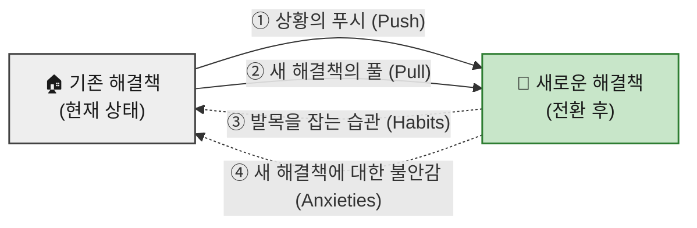

# 07 — 고객 상황을 객관화하는 JTBD 분석 방법론

> 본 문서는 07 챕터에서 진행할 **JTBD(Jobs-To-Be-Done) 분석**의 **기준 프레임**입니다.
> 개별 분석 결과는 이 방법론을 그대로 적용해 별도 문서로 작성합니다.

**이 문서의 범위** — JTBD **인터뷰를 실제로 수행하기 위한 행동 방침**을 다룹니다. 준비·질문·경청의 세 국면에 대한 컨텍스트 추출본입니다.

**선행 문서** — 이 분석은 앞 챕터의 산출물을 **재료로** 씁니다.

| 문서 | 여기서 가져오는 것 |
|---|---|
| `05-personas/persona-02-spectrum.md` | 인터뷰 대상이 될 사용자 유형(핵심·확장·극단·비활성) |
| `06-opportunity-score/aos-scoring.md` | Q1(혁신기회)으로 분류된 항목 — 방법론상 **JTBD 인터뷰 1순위 대상** |

---

## 1️⃣ 인터뷰 준비 및 구조

### ⏱️ 시간 배정

클래식한 **생성 연구(generative research)** 세션과 유사하게, 인터뷰 시간은 보통 **60분에서 90분**을 배정합니다.

> 이 기법에 익숙하지 않은 경우 **편안함을 느끼는 데 시간이 걸리기 때문**입니다.

### 🎯 고유한 참가자 모집 (Recruiting)

JTBD의 핵심은 **전환 행동(switching behavior)** 을 이해하는 것이므로, 특히 다음 세 그룹을 스크리닝하여 모집합니다.

| # | 모집 대상 | 무엇을 알 수 있나 |
|:-:|---|---|
| **①** | 최근에 우리 제품/서비스를 **사용하기 시작한** 사람들 | 우리에게로 **전환한** 이유 |
| **②** | 최근에 우리 제품/서비스 **사용을 중단한** 사람들 | 우리를 **떠난** 이유 |
| **③** | 우리 제품/서비스에 대해 **아직 들어본 적이 없는** 사람들 | 경쟁 제품으로 이끄는 요소 |

> 이들을 통해 사람들이 우리 제품/서비스로 **전환하거나 떠나는 이유**, 그리고 **경쟁 제품으로 이끄는 푸시/풀(Pushes/Pulls) 요소**를 이해하고자 합니다.

---

## 2️⃣ 심층 목표 파헤치기 (Focus on Deeper Goals)

| 원칙 | 내용 |
|---|---|
| **표면적 답변 피하기** | 단순히 사용자에게 **왜 다른 제품으로 전환했는지 직설적으로 묻는 것을 피해야** 합니다. 그렇게 하면 행동을 유도하는 **더 깊은 목표에 도달할 수 없습니다.** |
| **'전환 사건'에 집중** | 인터뷰이는 대화의 방향을 이끌도록 **허용하되**, 연구자는 참가자가 변화를 일으키게 된 **'전환 사건(switch event)'** 에 초점을 맞춰야 합니다. |
| **스토리텔링 유도** | 깊은 목표와 행동을 이해하려면 사용자가 무언가를 **하기로 결정한 배경에 대한 이야기**를 하도록 유도해야 합니다. 생성 연구와 마찬가지로 질문을 심층적으로 파고들되, **특정 방식으로** 진행해야 합니다. |

---

## 3️⃣ 핵심 질문 전략 (Interview Scripting)

연구자는 다음과 같은 주요 질문을 포함하여 대화의 맥락을 잡을 수 있으며, 이는 **대안 및 맥락 파악**에 중점을 둡니다.

### 🔍 대안 및 맥락 파악 질문

- 제품/서비스를 시도하기 **전에 다른 어떤 해결책을 고려**했습니까?
- 이러한 해결책을 고려할 때 **무엇을 찾고 있었습니까**?
- **무엇을 해결하려고** 했습니까?
- 이 제품/서비스들을 **어떻게 찾아보았는지** 이야기해 주십시오.
- 실제로 **사용해 본 다른 해결책**은 무엇입니까?
- 시도하거나 사용해 본 다른 해결책 중에서 **좋았던 점과 싫었던 점**은 무엇입니까?
- 이 제품/서비스를 **사용할 수 없었다면 대신 무엇을 했을** 것입니까?
- **주변 사람들이** 시도하거나 사용해 본 해결책은 무엇입니까?
- **과거와 비교했을 때** 지금 무엇을 하고 있습니까?

### 💓 맥락 및 감정적 질문

> 경쟁사 및 잠재적인 전환 행동을 파악한 **후에** 더 감정적인 질문을 통해 깊이 파고들기 시작합니다.

- 문제를 해결할 무언가가 필요하다는 것을 **언제 처음 깨달았습니까**?
- 고려 중인 선택에 대해 **다른 사람과 이야기했습니까**? 대화는 어땠습니까?
- 이 제품/서비스를 사용하면 **어떤 모습일지 상상**했습니까?
- 제품/서비스로부터 **무엇을 원했습니까**?
- 이 제품/서비스를 구매/사용하는 것에 대해 **불안감(anxiety)이 있었습니까**?
- 사용하는 것에 대해 **걱정하게 만드는 요소**가 있었습니까?

### 🧠 스토리텔링을 위한 연상 유도

> 사용자의 기억은 **사람, 장소, 냄새 또는 소리와의 연상**을 통해 회상되는 경우가 많습니다.

- 그때는 **하루 중 몇 시**였습니까?
- **집**에 있었습니까, **직장**에 있었습니까?
- 뒤에서 **TV가 켜져** 있었습니까?
- **당신은 어떤 상태**였습니까 *(who they were)*?

---

## 4️⃣ 경청해야 할 4가지 전환 동인 (Listening for the Switch)

인터뷰를 진행하는 동안, **전환을 유도한 동기나 페인 포인트(pain points)** 에 귀 기울여야 합니다.

| # | 동인 | 무엇을 듣는가 |
|:-:|---|---|
| **1** | **상황의 푸시 (Push)** | 특정 상황 중 **무엇이 그들을 새로운 해결책을 찾도록 이끌었습니까**? |
| **2** | **새로운 해결책의 풀 (Pull)** | 새로운 해결책의 **어떤 점이 그것을 시도하고 싶게 만들었습니까**? |
| **3** | **발목을 잡는 습관 (Habits)** | 새로운 해결책을 시도하는 것을 **방해할 수 있는 그들의 습관**은 무엇이었습니까? |
| **4** | **새로운 해결책에 대한 불안감 (Anxieties)** | 새로운 해결책을 시도하거나 사용하는 것에 대해 **어떤 불안감을 느꼈습니까**? |

> **①·②는 전환을 만드는 힘**이고, **③·④는 전환을 막는 힘**입니다. 네 가지를 모두 듣지 않으면 *"왜 안 바꾸는가"* 를 설명할 수 없습니다.
