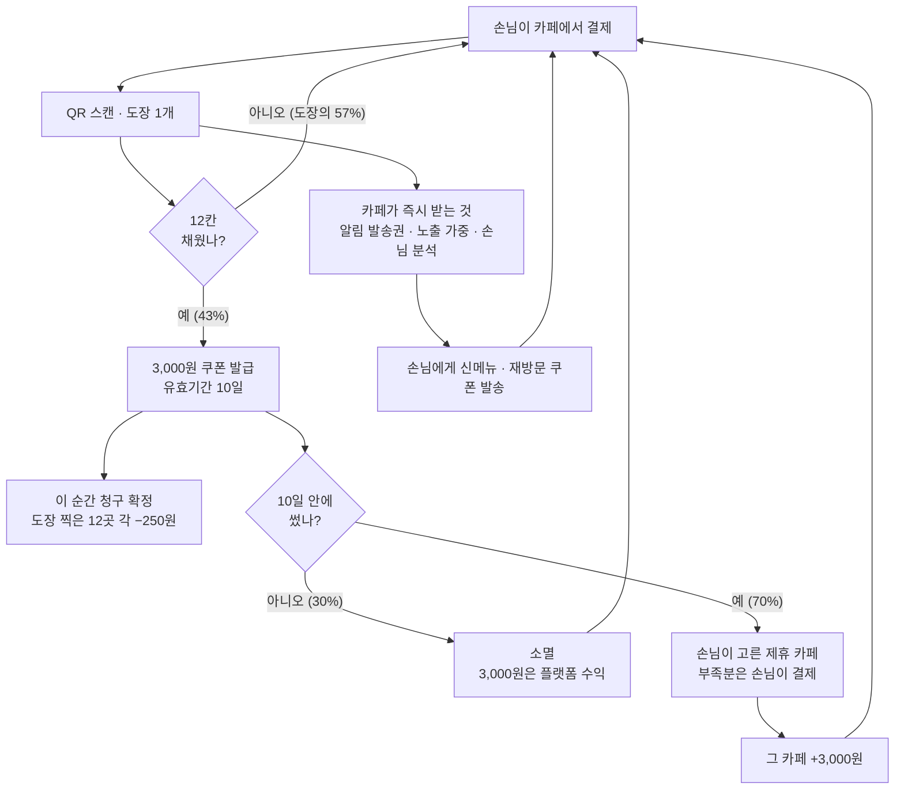
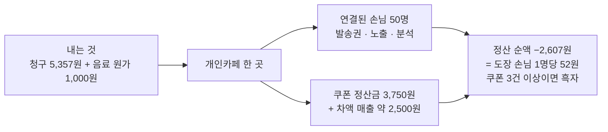
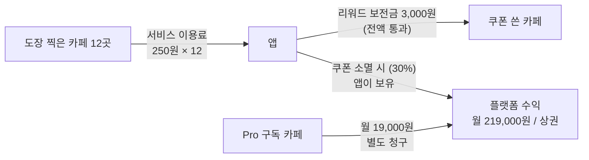

# 개인카페 통합 스탬프 서비스 기획

> **무엇을 정하는 문서인가:** *"동네 가게 멤버십"* 이라는 초기 구상을 **개인카페 × 커플·20대 여성**으로 좁히고, **리워드 원가를 누가 얼마나 부담하는가**까지 내려 기획 착수가 가능한 수준으로 만든다.
> **작성일:** 2026-08-13 · **상태:** 아이디에이션 (컨셉 확정 전 — 인터뷰로 §4 핵심 가설을 먼저 깨 봐야 한다)

---

## 0. 한 장 요약

**흩어진 저장·결정·기록을 한 곳으로 모으고, 한 번도 안 가 본 개인카페에 갈수록 유리해지는 통합 스탬프를 얹는다.
서로 다른 카페 12곳에서 도장을 찍으면 3,000원 쿠폰이 생기고, 그 값은 도장을 찍어준 12곳이 250원씩 나눠 낸다.**

| | |
|---|---|
| **타겟** | 커플 · 20대 여성 모임 — *"매번 새 가게"* 를 의도적으로 찾는 유일한 집단 |
| **핵심 전환** | 스탬프를 **재방문 보상 → 탐색 보상**으로 재정의 |
| **NSM** | 4주 내 서로 다른 개인카페 **3곳 이상** 방문한 사용자 비율 |
| **리워드** | 서로 다른 카페 **12곳** → **3,000원 금액권**, 유효기간 **10일** |
| **누가 내나** | 도장을 찍어준 **12곳이 250원씩** (합계 3,000원) |
| **카페 월 청구액** | 약 **5,357원** — 도장 손님 1명당 **107원** |
| **카페 월 정산 순액** | 평균 **−2,607원** — 도장 손님 1명당 **52원** (쿠폰 3건 이상 받으면 흑자) |
| **언제 청구되나** | **12칸을 채워 쿠폰이 생기는 순간.** 못 채우면 아무도 한 푼도 내지 않는다 |
| **카페가 즉시 받는 것** | **알림 발송권 · 홈 노출 가중 · 손님 분석** — 도장 찍는 그 순간 |
| **앱 수익** | 도장 분담금에서 **0원.** **Pro 구독 + 소멸 쿠폰 대금** (월 219,000원 / 상권 1개) |
| **1차 지역** | 도보권 개인카페 밀집 **1개 상권** |

> **한 줄 포지셔닝:** 네이버 지도는 *"거기 뭐 있어?"* 에 답하고, 우리는 **"오늘 우리 어디 가지?"** 에 답한다.
> **점주에게 할 말:** *"손님 한 명과 연결되는 데 52원. 인스타 광고 클릭 한 번의 3%이고, 이미 우리 가게에서 결제한 사람이다."*

---
---

# I부 · 왜 이 서비스인가

## 1. 대상 사용자 · 사용 상황

### 고객 — 두 갈래, 같은 목적

| | **커플** | **20대 여성 모임** |
|---|---|---|
| 구성 | 2인 | 2~4인 |
| 빈도 | 주 1~2회 데이트 | 월 2~4회 |
| 카페의 역할 | 데이트 코스의 **한 칸** | 만남의 **본체** (카페 자체가 목적지) |
| 체류 | 1~2시간 | 2~3시간 |
| 결정권 | 대체로 한 명이 후보를 찾고 함께 고름 | 단톡방에서 링크·캡처를 던지고 합의 |
| 공통 JTBD | **"오늘 우리가 시간을 보낼, 사진이 남을, 가 본 적 없는 곳을 고른다"** | ← 동일 |

> **핵심:** 두 집단의 카페 선택은 *"커피를 마신다"* 가 아니라 **"장소를 소비한다"**. 그래서 메가커피·컴포즈가 대체재가 아니다. 가격이 아니라 **경험의 새로움**을 사고 있다.

### 결정적 사용 순간 (Moment of truth)

```
① 며칠 전  — 인스타 릴스/피드에서 카페를 보고 "여기 가고 싶다" (저장)
② 당일 2시간 전 — "오늘 어디 가지?" (저장해 둔 게 어디 있는지 못 찾음)  ← 최대 마찰
③ 이동 직전 — 영업시간·웨이팅·주차·좌석을 각각 다른 앱에서 확인
④ 매장에서 결제 3초 — "적립 되세요?" → "저희 카카오채널 추가하시면…" (귀찮아서 포기)  ← 두 번째 마찰
⑤ 나온 뒤 — 좋았지만 기록이 안 남고, 다음에 또 다른 곳을 처음부터 찾는다
```

### 점주

| 항목 | 내용 |
|---|---|
| 대상 | 1~2인 운영 개인카페 사장 (본인이 바에 서 있음) |
| 순간 | 신메뉴를 냈는데 알릴 데가 인스타 계정 하나뿐인 순간 / 마감 후 오늘 손님 중 처음 온 사람이 몇인지 모르는 순간 |
| 현재 도구 | 인스타 계정, 카카오채널, 네이버 플레이스, 종이 쿠폰 — **네 개가 서로 모른다** |
| 관리 여력 | **거의 없음.** 매장 운영 중 앱을 켤 시간이 없다 → 점주용 기능은 "안 해도 되는 것"이 최우선 가치 |

---

## 2. AS-IS — 오늘 카페를 고르는 방법

| 단계 | 쓰는 도구 | 잘 되는 것 | 깨지는 것 |
|---|---|---|---|
| 발견 | **인스타그램** 해시태그·릴스 | 트렌드·감성은 여기밖에 없다 | 검색이 안 됨. 영업시간·좌석·위치 모름. 저장해도 다시 못 찾음 |
| 검증 | 네이버 지도/플레이스, 블로그 | 위치·영업시간·기본 정보 | 광고 블로그가 상위. **트렌디한 신규 카페는 아직 리뷰가 없다** |
| 결정 | 단톡방·카톡 공유 | 합의는 됨 | 링크가 흩어지고 대화에 묻힘 |
| 적립 | 종이 쿠폰 / 카카오채널 / 없음 | — | 매장마다 방식이 다름. **어차피 다시 안 올 거라 아예 안 만듦** |
| 기록 | 인스타 스토리, 사진첩 | 남기긴 함 | 어디였는지 나중에 못 찾음 |

> **한 문장 진단:** **저장은 인스타에, 결정은 지도에, 기록은 사진첩에 흩어져 있고 그 셋이 서로 연결되지 않는다.** 그래서 매번 처음부터 찾는다.

---

## 3. 문제 정의 — 세 겹

| # | 문제 | 누구의 문제 | 지금의 비용 |
|---|---|---|---|
| **P1** | **저장–결정–기록이 끊어져 있다** | 고객 | 갈 때마다 탐색을 처음부터. "가고 싶다"고 저장한 카페의 대부분을 결국 안 감 |
| **P2** | **적립이 매장 단위라 새 곳만 가는 사람에겐 아무 가치가 없다** | 고객 | 혜택을 통째로 포기. 매장 입장에선 계산대 3초를 쓰고도 아무것도 못 남김 |
| **P3** | **점주는 신규 고객에게 도달할 채널이 인스타 하나뿐이고, 그마저 알고리즘 의존** | 점주 | 좋은 카페인데 발견되지 않음. 멤버십은 관리 부담 대비 효과 불명 |

---

## 4. 핵심 모순과 해결 ★

이 문서에서 가장 중요한 한 페이지다.

### 모순

```
타겟의 행동   :  "같은 카페를 또 가지 않는다. 매번 새로운 곳을 찾는다"
스탬프의 원리 :  "같은 가게에 N번 오면 보상한다"
                  ↓
        타겟에게 기존 스탬프는 구조적으로 무용하다.
        초기 구상의 NSM(4주 재방문율)을 그대로 쓰면 타겟과 지표가 서로를 부정한다.
```

**"매번 회원가입이 귀찮다"는 표면 증상이고, 진짜 원인은 "다시 안 올 곳에 적립할 이유가 없다"** 이다. 회원가입 절차를 아무리 매끄럽게 만들어도 — 즉 UX만 고쳐도 — 이 문제는 안 풀린다.

### 해결 — 적립의 단위를 매장에서 **행동**으로 옮긴다

| | 기존 스탬프 | **통합 스탬프** |
|---|---|---|
| 보상 대상 | *같은 가게* 재방문 | ***서로 다른* 개인카페 방문** |
| 1개 조건 | A카페 방문 | **어느 개인카페든 방문 (같은 곳은 1개만)** |
| 리워드 | A카페 10잔째 무료 | **12곳 채우면 3,000원 쿠폰 — 제휴 카페 어디서나** |
| 고객 의미 | 단골 증명 | **탐험 기록 + 보상** |
| 점주 의미 | 재방문 유도 | **신규 고객 유입 채널** |

> **재정의:** 스탬프는 *충성도 보상*이 아니라 **탐색 보상(Exploration Reward)** 이다.
> 고객이 이미 하고 있는 행동(새 카페 찾기)에 **보상과 기록을 얹을 뿐**, 행동을 바꾸라고 요구하지 않는다. — 행동 변화를 요구하지 않는 제품이 채택된다.

### ⚠️ 먼저 깨야 할 가설 3개

| # | 가설 | 틀렸다면 |
|---|---|---|
| H1 | 타겟은 **스탬프가 있어서** 개인카페를 더 다닌다 | 스탬프는 있으나 마나 → 발견·기록 앱으로 축소하고 스탬프를 뺀다 |
| H2 | 점주는 **손님 1명당 52원**(도장 분담금)을 마케팅비로 받아들인다 | 온보딩 실패 → 분담금을 낮추거나 리워드를 플랫폼 협찬으로 대체 |
| H3 | **12곳**은 너무 멀지 않은 목표다 (도달률 20% 이상) | 완주율 붕괴 → 10곳으로 축소 (도장당 300원) |

> **인터뷰 설계의 목적은 이 세 개를 깨는 것**이다. 확인이 아니라 반증을 하러 간다.

---

## 5. 서비스 컨셉

> ### *"새로운 카페를 찾는 일이, 그 자체로 쌓이게 한다."*
>
> 흩어진 저장·결정·기록을 한 곳으로 모으고,
> **한 번도 안 가 본 개인카페에 갈수록 유리해지는** 통합 스탬프를 얹는다.
> 점주가 시작하는 데 필요한 건 스탠딩 QR 하나뿐이다.

---
---

# II부 · 무엇을 만드는가

## 6. 핵심 기능 — v1 (고객)

| # | 기능 | 하는 일 | 왜 v1인가 |
|---|---|---|---|
| **F1** | **오늘의 개인카페 탐색** | 지역 × 무드 태그(감성/작업/대화/뷰) × 2인·4인 좌석 × 영업시간 × 도보 거리 | P1 정면. 인스타에 없는 **필터**, 지도에 없는 **큐레이션** |
| **F2** | **통합 스탬프** | 매장 QR 1회 스캔 = 방문 인증 1개. **같은 카페는 1개만 인정.** **12곳 달성 → 3,000원 쿠폰**(제휴 카페 어디서나, 10일) | P2 정면. III부의 구현체 |
| **F3** | **모임 관점 리뷰** | 별점이 아니라 **축별 응답**: 2인석 유무 / 대화 소음 / 콘센트 / 눈치 없이 머무는 시간 / 사진 잘 나오는 자리 | 기존 리뷰가 답 못 하는 것만 묻는다. 짧아서 작성률이 높다 |
| **F4** | **저장 → 오늘의 코스** | 저장 목록을 지도 위에서 2~3곳 코스로. 링크 공유 시 상대도 앱 없이 열람 | P1의 ②구간. **단톡방 공유가 유일한 자연 유입 경로** |
| **F5** | **내 카페 지도** | 방문한 카페가 지도에 채워짐. 월별 회고 카드 → 인스타 공유 | 기록이 곧 자랑 → 스탬프의 비금전적 동기. 리워드 원가 없이 작동 |

**v1에서 의도적으로 안 하는 것:** 예약 · 웨이팅 · 실시간 혼잡도 · 주문 · POS 연동 · 자체 결제.

---

## 7. 점주 쪽 — 3화면에서 멈춘다

> 두 얼굴 서비스는 범위가 쉽게 커진다 → **점주 앱은 3화면 이내.**
> **v1의 점주 경험은 사실상 "앱이 아니다"** — 스탠딩 QR 배너 1개 + 웹 페이지 3화면.

| 화면 | 내용 | 점주가 얻는 문장 |
|---|---|---|
| 1 | **오늘** — 방문 수 / 그중 처음 온 손님 / 최근 7일 추이 | "오늘 처음 온 손님이 몇 명인지 처음 알았다" |
| 2 | **리워드** — 이번 달 예상 청구액, 쿠폰 수령 ON/OFF·일 한도·월 분담 상한 | "이번 달 1,000원 내고 손님 50명과 연결됐다" |
| 3 | **우리 가게** — 사진·태그·영업시간·소개 (인스타 연동으로 자동 채움) | "인스타만 하면 여기도 최신이 된다" |

**점주 온보딩 = QR 배너 받기.** 설치·교육·POS 연동 없음. → 이게 개인카페에서 유일하게 통하는 온보딩이다.

---
---

# III부 · 스탬프 혜택 정책 ★

> **이 부에서 정하는 것**
> ① 도장 1개당 얼마를 받을 것인가 — 업계 마케팅 단가에서 역산한 금액
> ② 도장을 찍어주는 카페와 쿠폰을 받는 카페, **양쪽 모두** 억울하지 않게 만드는 방법
> ③ 그 위에서 **플랫폼은 어디서 돈을 버는가**

## 8. 어떻게 돌아가나

```
   손님이 카페에서 결제하고 QR을 찍는다 → 도장 1개
   (한 카페당 도장 1개. 서로 다른 카페여야 쌓인다)
                      │
                      │  ← 이 순간, 카페는 대가를 받는다 (§11)
                      ▼
        12번째 도장이 찍히는 순간 → 3,000원 쿠폰 발급 🎫
                      │
                      │  ← 이 순간, 12곳에 250원씩 청구가 확정된다 (§13)
                      ▼
              ⏳ 10일 안에 써야 한다
                      │
        ┌─────────────┴─────────────┐
        ▼                           ▼
  손님이 고른 제휴 카페에서 사용      기간 만료 → 소멸
        │                           │
        ▼                           ▼
  그 카페가 3,000원을 받는다      그 3,000원은 플랫폼 수익
  (부족분은 손님이 결제)
```

**쿠폰을 쓰는 카페는 손님이 고른다 — 확정**

- 우리 서비스에 등록된 카페 안에서라면 **어디를 고르든 손님 자유**다
- 도장을 찍었던 카페에서 써도 된다. 그 카페는 **250원을 내고 3,000원을 받는다**
- 앱은 **최근 사용 건수가 적은 곳을 위에 보여줄 뿐**, 선택을 제한하지 않는다 (편중 방지)

---

## 9. 금액을 어디서 가져왔나 — 업계 마케팅 단가 ★

**개인카페가 지금 손님 1명에게 쓰는 돈이 기준선이다.**

| 조사 항목 | 값 |
|---|---|
| 개인카페 월 손님 수 | 약 **1,500명** (일 50명 · 월 매출 600만~1,000만원대) |
| 숙박·음식점업 소상공인 월평균 온라인 광고비 | **24만원** (배달앱 포함 — 비배달 개인카페엔 과대치) |
| 인스타그램 광고 자영업 권장 시작 예산 | **월 30만원** (CPC 약 1,650원) |
| 네이버 플레이스 광고 | CPC 50~5,000원 / 지역소상공인광고 유효노출당 1원 |
| 배달앱 **광고비만** 매출 대비 | **2.9%** (총 수수료는 16.9~29.3%) |
| **→ 손님 1명당 마케팅비** | **최대 약 200원** (24만원 ÷ 1,500명 = 160원 / 30만원 ÷ 1,500명 = 200원) |

### 역산

```
목표: 도장 손님 1명당 부담을 200원 아래로 넣는다
      ↓
쿠폰 3,000원 ÷ 도장 12개 = 도장 1개당 250원
      ↓
청구는 완주에 기여한 도장에만 (도달률 20% 기준 43%)
      ↓
도장 손님 1명당 청구  107원   ◎
쿠폰 정산금까지 반영한 실부담  52원   ◎
```

### 왜 쿠폰이 3,000원인가 — 쿠폰 받는 카페는 손해가 없다

| | 5,000원 쿠폰 | **3,000원 쿠폰** |
|---|---|---|
| 앱에서 받는 정산금 | 5,000원 | 3,000원 |
| 손님이 내는 차액 | 0원 | **약 2,000원** |
| 음료 원가 | −800원 | −800원 |
| **쿠폰 받는 카페의 이익** | **+4,200원** | **+4,200원** |
| 도장 찍는 카페의 표시 단가 | 500원 | **250원** |

> **쿠폰이 음료 값보다 작으면 손님이 차액을 결제한다.** 쿠폰 받는 카페의 이익은 그대로이고, **줄어드는 건 도장 찍는 카페의 부담뿐**이다.
> ⚠️ 위 계산은 **음료 단품 5,000원** 기준이다(부록의 객단가 6,500원은 디저트 등을 포함한 값이라 다른 개념). 손님이 3,000원 이하 메뉴를 고르면 차액은 0이고, 그때 쿠폰 카페의 이익은 +2,200원으로 줄어든다.

---

## 10. 카페 한 곳의 한 달 — 점주에게 보여줄 화면 ★

**점주에게는 도장 단가가 아니라 월 예상 금액을 보여준다.** 마케팅 예산은 월 단위로 생각하기 때문이다.

> ### 이번 달 예상
> **상권 평균 기준 — 약 1,000원** (도장 손님 한 분당 52원)
> **연결된 손님 50명** · 쿠폰 방문 1.25건
>
> *쿠폰을 3건 이상 받으시면 이번 달은 **플러스**로 끝납니다.*

### 계산 (상권 30곳 · 월 완주 54건 · 소멸률 30% 기준)

| | 계산 | 금액 |
|---|---|---|
| 우리 가게에서 찍힌 도장 | 월 **50개** (그중 완주 기여 43%) | |
| **낼 돈** | 21.4개 × 250원 | **−5,357원** |
| **받을 돈** | 쿠폰 **1.25건** × 3,000원 | **+3,750원** |
| 음료 원가 | 1.25잔 × 800원 | **−1,000원** |
| **정산 순액 (상권 평균)** | | **−2,607원** |
| 그 외 | 손님 **차액 결제 약 2,500원** (매출) | |
| **얻은 것** | **연결된 손님 50명** (발송권 50장) · 방문 1.25건 | |

### 쿠폰을 몇 건 받느냐가 전부를 가른다

| 그달 쿠폰 수령 | 정산 순액 |
|---|---|
| 0건 (쿠폰 받기를 끔) | −5,357원 |
| **1.25건 (상권 평균)** | **−2,607원** |
| 2건 | −957원 |
| **3건 이상** | **+1,243원 — 흑자 전환** |

> **왜 평균이 마이너스일 수밖에 없나:**
> ```
> 카페 전체의 정산 순액 합계 = −(소멸 대금) − (음료 원가)
> ```
> 카페들이 실제로 부담하는 건 **① 손님에게 내준 음료 원가**와 **② 앱이 가져간 소멸 대금** 둘뿐이다. 이 구조에서 전체 평균이 플러스가 되는 것은 산술적으로 불가능하다. 개별 카페는 쿠폰을 평균보다 많이 받으면 흑자가 된다.

### 단가 비교 — 분모가 다르다는 점에 주의

| 비교 대상 | 값 | **분모** |
|---|---|---|
| 인스타그램 광고 | 1,650원 | **클릭 1회당** (방문 아님) |
| 소상공인 평균 온라인 광고 | 약 160원 | 전체 손님 1,500명당 |
| **이 앱 — 청구 기준** | **107원** | 도장 찍은 손님 50명당 |
| **이 앱 — 정산 순액 기준** | **52원** | 도장 찍은 손님 50명당 |

> **도장 손님의 결제액 대비 1.7%** (5,357원 ÷ 50명 × 6,500원). 월 매출 전체 대비로는 0.05~0.09% 수준이다 — 두 숫자를 섞어 쓰지 않는다.

---

## 11. 도장을 찍는 즉시 카페가 받는 것 ★

**청구는 완주할 때, 대가는 도장 찍을 때.** 이 비대칭이 카페에게 유리한 지점이다.

| 도장 1개를 찍어주면 | 내용 |
|---|---|
| **① 알림 발송권 1장** | 그 손님에게 **신메뉴·이벤트·재방문 쿠폰**을 보낼 권리 (유효 6개월) |
| **② 홈 노출 가중** | 그 손님의 앱 홈에 **'다녀온 카페'** 우선 노출 + 상권 검색 순위 상승 |
| **③ 손님 분석** | 방문 시간대·요일, **처음 온 손님/다시 온 손님** 비율, 선호 무드 |

**동의는 계산대가 아니라 앱에서 받는다.** 도장 찍는 화면에서 **"이 카페 소식 받기"** 한 번 누르면 끝이다. *"저희 카카오채널 추가하시면…"* 이 계산대에서 실패하는 문제를 우회한다.

- 카페별로 **손님이 언제든 끌 수 있다** · 한 손님에게 **월 2회 상한** · **야간(21~08시) 차단**
- 손님 데이터는 **개인 식별 없이 집계값만** 제공한다

> **12칸을 못 채운 손님의 도장에는 청구가 없다.** 전체 도장의 약 57%가 여기 해당하고, 그 도장들에 대해서도 카페는 위 세 가지를 그대로 가진다.
> ⚠️ 다만 **이 세 가지가 실제로 250원어치인지는 아직 검증되지 않았다.** 발송권 → 재방문 전환율이 이 정책의 유일한 근거다.

---

## 12. 원가를 누가 내는가 — 모델 선택 ★

통합 스탬프는 "A에서 모아 B에서 쓴다". B는 왜 남이 모은 스탬프를 받아 주는가?

| 모델 | 원가 부담 | 판정 |
|---|---|---|
| ⓐ 플랫폼이 부담 | 앱 | ✕ 초기엔 되지만 사용자 수에 비례해 무한 증가. 지속 불가 |
| ⓑ 정산 풀 (모은 곳→쓴 곳 **자금 이전**) | 카페 간 | ✕ 앱이 카페 A의 돈을 **맡아 두었다가** B에게 전달 = 자금 이전 중개 |
| ⓒ 회수처 자원(opt-in) + 저원가 리워드 | 혜택 제공 신청 카페 | △ 검토했으나 미채택 — 아래 |
| **ⓓ 앱이 당사자로 청구·보전** | **도장을 찍어준 카페 12곳이 분담** | **◎ 채택** |

### ⓒ를 버리고 ⓓ를 택한 이유

초기 판단은 ⓒ였다. *"앱은 돈을 만지지 않는다"* 를 지키려고 **리워드를 회수처 카페가 통째로 떠안는** 구조였는데, 두 가지가 걸렸다.

| 걸린 것 | 내용 |
|---|---|
| **부담이 한쪽에만 쏠린다** | 도장을 찍어준 카페는 한 푼도 안 내고, 혜택을 주는 카페만 원가를 전부 낸다. 회수처 참여를 선의에 기대게 된다 |
| **저원가 리워드로는 완주 동기가 안 생긴다** | 쿠키·샷추가(300~800원)를 받으려고 서로 다른 카페 12곳을 다니지는 않는다 |

### ⓓ가 ⓑ와 다른 지점 — 앱의 법적 위치

| 구조 | 앱의 위치 | 판정 |
|---|---|---|
| 앱이 A의 돈을 **맡아 두었다가** B에게 전달 (ⓑ) | 자금 이전 중개 | ✕ |
| **앱이 A에게 이용료를 청구하고, 앱이 B에게 보전금을 지급** (ⓓ) | **거래 당사자** | ◎ |

앱은 전달자가 아니라 **양쪽과 각각 계약한 당사자**다. 카페 A는 앱에 **서비스 이용료**를 내고, 앱은 카페 B에 **리워드 보전금**을 지급한다 — 현금을 보관하는 구간이 없고(월말 순액 1회), 카페 사이에 직접 채권·채무가 생기지 않는다.

**지켜야 할 선 3개**

1. **손님이 충전하거나 환급받을 수 있는 것은 만들지 않는다** — 쿠폰은 물품 교환권이지 금전이 아니다. 잔액 환급·현금 거스름 없음
2. **앱이 현금을 보관하지 않는다** — 쿠폰 유효기간 동안 움직이는 건 장부상 채권뿐, 현금은 월말 순액 1회 (§13③)
3. **카페 사이에 직접 채권·채무가 생기지 않게 한다** — 모든 계약은 앱과 각 카페 사이 1:1

> **그 대신 v1부터 앱이 돈을 만지게 된다.** 이건 초기 원칙의 명시적 번복이며, **법률 검토를 정산 개시 전 필수 조건으로 둔다.**
> ⚠️ **가정 — 사실로 쓰지 말 것:** 위 구조가 전자금융거래법상 자금이체업·선불전자지급수단에 해당하지 않는다는 방향은 합리적이나 **법률 검토를 받지 않았다.** 특히 **§14 소멸 대금을 앱이 수취하는 구조는 별도 검토가 필요하다.**

---

## 13. 언제 청구하고 언제 정산하나

### ① 청구 확정 = 쿠폰이 생기는 순간

| 시점 | 무슨 일이 일어나나 |
|---|---|
| 도장을 찍을 때 | **아무 돈도 오가지 않는다.** 카페는 §11의 세 가지만 가져간다 |
| **12칸을 채워 쿠폰이 생길 때** | **12곳에 250원씩 청구가 확정된다** |
| 쿠폰을 쓸 때 | 사용처 카페에 3,000원 지급이 확정된다 |
| 쿠폰이 소멸할 때 | 청구는 유효, 지급은 없음 → **차액이 플랫폼 수익** (§14) |

### ② 쿠폰 사용 확인 절차

지급 3,000원을 확정하는 **유일한 이벤트**이므로 절차를 명시한다.

1. 손님이 앱에서 쿠폰을 열면 **60초 카운트다운이 도는 사용 화면**이 뜬다 (캡처 재사용 방지)
2. 점주가 매장 태블릿/점주 앱으로 **손님 화면의 코드를 스캔**하거나, 점주 화면에서 **[사용 처리]** 를 누른다
3. 처리 즉시 양쪽 화면에 **"사용 완료"** 가 뜨고 쿠폰은 소진된다 — 되돌리기는 당일 내 점주 요청으로만
4. **오프라인 상황:** 앱이 6자리 대체 코드를 표시하고, 점주가 나중에 입력해도 사용 시각은 손님이 코드를 연 시각으로 기록된다

### ③ 현금은 월 1회 · 순액으로 한 번만 움직인다

```
낼 돈 5,357원  −  받을 돈 3,750원  =  낼 순액 1,607원
                                        ↑ 한 번만 이체한다
```

- **매월 말 집계 → 익월 10일 자동이체(CMS) 1건**
- **앱은 현금을 보관하지 않는다.** 쿠폰이 살아 있는 10일 동안 움직이는 건 장부상 채권뿐이다
- **Pro 구독료는 별도 청구** — 리워드 정산금과 섞지 않는다 (섞으면 "앱이 떼간다"는 오해가 생긴다)

---

## 14. 앱은 어디서 버는가 — Pro 구독과 소멸 대금 ★

### ① 무료와 유료의 경계선

§11의 세 가지를 전부 무료로 주면 앱이 팔 것이 없어진다. 그래서 선을 하나 긋는다.

> **성과를 보여주는 것은 무료. 그 성과를 크게 쓰는 도구는 유료.**

| | **무료** (도장 250원의 대가) | **Pro 구독** |
|---|---|---|
| **알림** | 발송권 적립 · **한 명씩 개별 발송** | **일괄 발송 · 예약 발송 · 조건 타겟팅**("3개월 안 온 손님만") |
| **노출** | 발행량 비례 **자동** 가중 | **시간대·요일 지정 부스트** · 신메뉴 배너 |
| **분석** | 이번 달 숫자 | **기간 비교 · 손님 세그먼트 · 상권 벤치마크 · 주간 리포트** |

**전환이 일어나는 지점:** 무료로도 발송권이 **월 50장씩 쌓인다.** 개별 발송만으로는 다 쓰기 번거로워지는 지점에서 Pro가 필요해진다.

- 구독료 **월 19,000원** (초기 3개월 무료) — 인스타 광고 월 30만원의 6%
- ⚠️ 무료 기능을 의도적으로 불편하게 만들어 전환을 유도하지 않는다 — 개별 발송은 **한 명에게 보내는 용도로 충분히 편해야** 한다

### ② 소멸한 쿠폰 대금

쿠폰이 10일 안에 안 쓰이면 소멸한다. 그때 **이미 확정된 3,000원은 카페로 돌아가지 않고 플랫폼 수익이 된다.**

| 항목 | 금액 | 비중 |
|---|---|---|
| Pro 구독 (30곳 × 전환 30% × 19,000원) | 171,000원 | 78% |
| 소멸 쿠폰 대금 (월 완주 54건 × 소멸률 30% × 3,000원) | 48,000원 | **22%** |
| **합계 / 상권 1개** | **219,000원** | |

> **⚠️ 이해상충 — 반드시 짚어둔다:** 이 구조에서 **앱은 쿠폰이 안 쓰이는 편이 이득이다.** 유효기간을 짧게 잡거나 사용을 불편하게 만들 유인이 생긴다. 소멸 수익이 전체의 22%라 무시할 수 있는 규모도 아니다.
>
> **통제 방법 — 수익 비중이 아니라 소멸률 자체를 관리한다.**
> - **소멸률 상한 30%.** 초과하면 쿠폰 유효기간을 자동으로 14일로 연장한다
> - 소멸률을 **KPI 목표로 삼지 않는다.** 올리는 방향의 목표는 어떤 문서에도 쓰지 않는다
> - 유효기간·사용 절차 변경은 **손님 편의 기준으로만** 판단한다

---

## 15. 12곳은 멀다 — 완주율을 지키는 장치 ★

도장 12개는 **월 4곳 방문 기준 약 3개월**이다. 손님이 중간에 포기하면 **정산도 방문도 아예 생기지 않는다.** 이 안의 가장 큰 위험이고, 다음 장치로 막는다.

| 장치 | 내용 |
|---|---|
| **카드는 무기한** | 유효기간을 두는 건 **쿠폰(10일)뿐이다.** 도장 카드 자체는 만료되지 않는다 |
| **진행률 알림** | 6/12(절반) · 9/12(**"3곳만 더!"**) · 11/12에 푸시 1회씩 |
| **다음 목적지 제안** | 지도에 **아직 안 가본 참여 카페**를 표시 — F1 탐색 기능이 그대로 완주 장치가 된다 |
| **완주 후 즉시 재시작** | 12칸을 채우면 **다음 카드가 바로 열린다.** 쿨다운 없음 |
| **커버리지 요건 상향** | 12곳을 채우려면 상권에 **최소 25곳 이상** 참여해야 한다. "카페 30~50곳 · 커버리지 60%"가 **선택이 아니라 전제 조건**이 된다 |

> ⚠️ **III부의 모든 숫자는 도달률 20%를 전제로 한다.** 12칸 도달률이 20%에 못 미치면 §10의 계산이 통째로 흔들린다. 미달 시 **도장 개수를 10개(도장당 300원)로 내린다** — 완주는 쉬워지지만 카페 부담은 오히려 커진다는 점을 감수하는 선택이다.

---

## 16. 억울한 사람이 없게

### 도장을 찍어주는 카페 쪽

| 억울할 수 있는 상황 | 장치 |
|---|---|
| **우리 손님인데 왜 우리가 내나** | **도장 찍는 즉시 §11의 세 가지를 받는다.** 청구는 나중에, 대가는 지금 |
| **250원이 부담된다** | 도장 손님 1명당 실부담 **52원** — 소상공인 평균 온라인 광고비(160원/명)의 3분의 1 |
| **평균이 마이너스다** | 사실이다(§10). **쿠폰을 3건 이상 받으면 흑자**로 돌아서고, 그 전까지도 손님 50명과의 연결이 남는다 |
| **나가는 돈이 예측이 안 된다** | 점주 화면에 **월 예상 금액**으로 표시 + **월 분담 상한**(기본 2만원)을 직접 설정 |

### 쿠폰을 받는 카페 쪽

| 억울할 수 있는 상황 | 장치 |
|---|---|
| **3,000원어치를 그냥 내준다** | **3,000원을 받고, 손님이 차액도 결제한다** → 실질 +4,200원 |
| **하루에 몰려와서 감당이 안 된다** | **일 한도**(기본 5건). 채우면 그날은 사용처 목록에서 자동 제외 |
| **쿠폰 손님이 인기 카페로만 간다** | 사용처를 보여줄 때 **최근 사용 건수가 적은 곳을 위로** (선택은 손님 자유) |

---

## 17. 예외 처리 ★

정산이 걸려 있는 이상, 예외를 정하지 않으면 첫 달에 바로 막힌다.

| 상황 | 처리 |
|---|---|
| **12곳 중 일부가 못 낸다** (월 상한 도달·미납·폐업) | **부족분은 앱이 부담한다.** 쿠폰 금액은 손님에게 3,000원 그대로 유지된다 — 손님에게 카페 사정이 전가되지 않는다 |
| **월 분담 상한 도달** | 그 달은 **도장 발행과 쿠폰 수령이 함께 정지**된다. 내지 않으면 받지도 않는다 |
| **자동이체 실패** | 1회 재시도 후 도장 발행·쿠폰 수령 동시 정지. 납부 확인 시 즉시 재개 |
| **카페 폐업·탈퇴** | 이미 확정된 청구는 유효. 미납분은 앱이 부담하고 손실 처리한다. 진행 중인 손님 카드의 그 카페 도장은 **유효하게 유지**된다 |
| **부가세** | 도장 분담금 250원과 쿠폰 보전금 3,000원은 **VAT 별도**로 표기하고, 앱↔카페 양방향 모두 **세금계산서를 발행**한다. 점주 화면 금액은 VAT 포함가로 보여준다 (250원 → 275원) |
| **손님 결제 취소** | 결제 취소 시 그 도장은 회수된다. 이미 쿠폰이 발급된 뒤라면 쿠폰은 유효하고 청구도 유지한다 |
| **손님 탈퇴** | 미완성 카드는 소멸. 이미 확정된 청구·지급 기록은 **정산 증빙으로 5년 보존**하되 개인 식별 정보는 즉시 분리·파기한다 |
| **청구 이의제기** | 점주 화면에서 건별 명세(어느 손님의 몇 번째 도장인지, 개인 식별 없이)를 확인하고 **14일 내 이의 신청** 가능 |
| **단가 변경** | 이미 찍힌 도장에는 **찍힌 시점의 단가**를 적용한다. 소급하지 않는다 |

---

## 18. 설정값 한눈에

| 항목 | 기본값 | 언제 바꾸나 |
|---|---|---|
| 완주 조건 | 서로 다른 카페 **12곳** | **12칸 도달률 20% 미만이면 10곳으로** (§15) |
| 쿠폰 | **3,000원 금액권** | 손님 완주 동기가 약하면 상향 |
| 도장 1개당 분담 | **250원** (쿠폰 ÷ 12) | 완주 조건이 바뀌면 자동으로 바뀜 |
| 쿠폰 유효기간 | **10일** (D-3 알림 1회) | **소멸률 30% 초과 시 자동으로 14일** |
| 도장 카드 유효기간 | **없음** · 완주 후 즉시 재시작 | — |
| 잔액 처리 | **환급·거스름 없음** | — |
| 앱 수수료 | **0%** — 250원 전액이 카페로 | 바꾸지 않는다 |
| 소멸 쿠폰 대금 | **전액 앱 수익** | 소멸률로 관리 (수익 비중으로 관리하지 않음) |
| 알림 발송권 | 도장 1개당 1장 · 유효 6개월 | — |
| 손님당 알림 상한 | 월 2회 | 수신거부율 상승 시 |
| 쿠폰 사용 일 한도 | 5건 (점주 설정) | 응대 부담 호소 시 |
| 월 분담 상한 | 20,000원 (점주 설정) | 도달 시 도장 발행·쿠폰 수령 함께 정지 |
| Pro 구독료 | 월 19,000원 (3개월 무료) | 점주 WTP 조사 결과에 따라 |
| 점주 화면 가격 표시 | **월 예상 금액** | — |

---
---

# IV부 · 어떻게 검증하고 지키는가

## 19. 로드맵

| 단계 | 핵심 | 성공 조건 (다음으로 넘어가는 문) | 앱이 돈을 만지나 |
|---|---|---|---|
| **v1 · 발견 + 통합 스탬프** | 1개 상권, 카페 30~50곳 | 지역 내 개인카페 **커버리지 60%+** & NSM 달성 | **○ — 도장 분담금 정산** |
| **v2 · 큐레이션 · 코스 · 점주 마케팅** | 신메뉴 알림, 코스 큐레이션, Pro 구독 | 점주 유료 전환 의향 확인 | ○ |
| **v3 · 자체 페이 ★** | 앱 결제 시 스탬프 가중(예: 1.5~2배) | v2까지의 결제 전환 의향 · 규제 검토 완료 | **○ — 성격이 바뀐다** |

### v3(자체 페이)에 대한 정직한 판단

**"페이로 결제하면 스탬프를 더 준다"** 는 강력한 락인이지만, **v3에서 이 서비스는 지급결제 사업이 된다.**

| 넘어야 할 것 | 내용 |
|---|---|
| 규제 | 선불충전형이면 **선불전자지급수단 발행업 등록** + 선불충전금 별도관리. 결제대행형이면 **PG 제휴**로 우회 가능 (v3-a로 먼저) |
| 정산 | 개인카페 대상 **정산 주기·수수료** 설계 필요 |
| 경쟁 | 카카오·네이버·토스페이가 이미 QR을 깔아 둠. **우리가 이기는 유일한 이유는 "스탬프 가중"** — 이 가중이 결제 전환을 만드는지가 v3의 단일 가설 |
| 순서 | **충전형(선불업)은 마지막.** v3-a 카드 연결형(PG) → v3-b 충전형 |

> ⚠️ **가정:** 2024.9.15 시행 개정 전자금융거래법으로 선불업 등록 면제 기준이 축소되고 충전금 별도관리 의무가 도입되었다는 방향은 확실하나, **구체적 임계 수치는 미확인** — 문서에 수치로 쓰지 말고 v3 착수 전 원문 확인.

---

## 20. KPI Tree

```
NSM  4주 내 서로 다른 개인카페 3곳 이상 방문한 사용자 비율
     ↑ "탐색을 계속하게 만들었는가" — 재방문율이 아니다

├─ Input ─ 저장 → 실제 방문 전환율        (P1이 풀렸는가)
│         ─ 방문 중 QR 인증률              (F2가 3초 안에 되는가)
│         ─ 코스 링크 공유 → 신규 설치     (유일한 자연 유입)
│         ─ 지역 내 개인카페 커버리지 %    (양면 시장의 공급측)
│         ─ 리뷰 작성률 (방문 대비)
│
├─ Input(정산) ─ 12칸 도달률           (20% 미만이면 III부 전체가 흔들림)
│              ─ 쿠폰 사용률 / 소멸률   (소멸 30% 초과 시 유효기간 연장)
│              ─ 발송권 → 재방문 전환율 (도장 250원의 유일한 근거)
│
├─ Guardrail ─ 점주 4주 이탈률 (QR 철거)
│             ─ 쿠폰 사용처 편중도 (상위 3곳 비중 > 60% = 위험)
│             ─ 카페 월 정산 순액 분포 (적자 카페 비율)
│             ─ 정산 미납·자동이체 실패율
│             ─ 인증 어뷰징 의심 비율
│             ─ 알림 수신거부율
│
└─ [반증] ─ 스탬프 미노출군 vs 노출군의 신규 카페 방문 수 차이
           → 차이가 없으면 통합 스탬프는 불필요한 기능이다. (H1 검정)
           ─ 스탬프 완주자의 회수 후 4주 잔존율
           → 리워드 받고 이탈하면 이건 쿠폰앱이지 습관이 아니다.
```

> ⚠️ **NSM(4주)과 완주(12곳·약 3개월)는 시간 지평이 다르다.** 4주 지표로는 정산 구조가 도는지 검증할 수 없다 — 정산 관련 판단에는 Input(정산) 지표를 12주 단위로 따로 본다.
>
> **NSM을 바꾼 것이 이 문서의 가장 큰 결정이다.** 초기 구상의 *4주 재방문율*은 "단골"을 목적으로 두지만, 이 타겟의 가치는 **탐색의 지속**에 있다. 지표가 타겟을 따라가야 한다.

---

## 21. 규제 → 제품 통제

| 규제 | 제품 결정 | 감지 지표 |
|---|---|---|
| **전자금융거래법** (선불전자지급수단) | **스탬프 자체에는 금전 가치가 없다** — 충전·환급·양도 전면 배제. 쿠폰은 **물품 교환권**이며 잔액 환급·현금 거스름 없음. **앱은 현금을 보관하지 않는다**(§12·§13③). ⚠️ **정산 개시 전 법률 검토 필수** | 환급 문의 = 0 · 현금 보유일수 = 0 |
| 〃 (v3) | 카드 연결형(PG 제휴) 우선, 충전형은 등록 요건 검토 후 별도 판단 | — |
| **위치정보법** | GPS 방문 인증 도입 시 **위치기반서비스사업 신고** 필요. v1은 **QR 우선**, GPS는 보조로 두고 사전 동의 분리 | 위치 동의 거부율 |
| **정보통신망법** | 광고성 정보 **사전 동의 분리**(방문 인증 동의와 알림 동의를 나눠 받는다), 야간(21~08시) 전송 차단, 수신거부 즉시 반영. *신메뉴 알림은 명백히 광고성* | 수신거부율, 야간 발송 = 0 |
| **전자상거래법 · 추천보증 심사지침** | 리뷰 서비스의 핵심 리스크. **협찬·제휴 리뷰 표기 의무화**, 리워드 대가 리뷰 금지, 삭제·수정 이력 보존 | 미표기 협찬 리뷰 = 0 |
| **개인정보보호법** | 방문 이력은 **동선 정보**다 — 최소 수집, 보관 기한 명시·자동 파기, 점주에겐 **개인 식별 없이 집계값만** 제공 | 점주 화면 개인식별 노출 = 0 |

> **관통하는 원칙:** *"앱은 돈을 보관하지 않고, 점주는 개인을 보지 않는다."*
> 초기 원칙은 *"앱은 돈을 만지지 않는다"* 였으나 §12ⓓ 채택으로 **보관하지 않는다**로 좁혀졌다. 자금은 오가되 앱에 머무는 구간이 없다는 뜻이며, 이 차이가 규제선의 위치를 결정한다.

---

## 22. 새는 구멍 막기

| 위험 | 막는 방법 |
|---|---|
| 안 가고 QR 사진만 찍기 | QR에 **회전 코드**(매장 태블릿/사장님 폰 표시) 또는 **GPS 반경 + QR** 이중 확인 |
| 같은 카페에서 여러 번 | **한 카페당 도장 1개** · 하루 1회 |
| 계정 여러 개로 반복 완주 | 기기·결제수단 기준 **중복 계정 탐지** (완주 횟수 자체는 제한하지 않는다) |
| 지인 카페끼리 도장 품앗이 | **물리적으로 불가능한 이동**(거리 ÷ 시간)이 감지되면 자동 검토. *하루 2~3곳 방문은 F4 코스의 정상 사용이므로 건수만으로 판정하지 않는다* |
| 유령 매장 등록 | 온보딩 시 **사업자등록증 확인** (v1은 수기 검수 — 초기 매장 수가 적으므로 가능) |
| 쿠폰 손님이 하루에 몰림 | **일 한도 5건** |
| 쿠폰 화면 캡처 재사용 | **60초 카운트다운 + 점주 스캔** (§13②) |
| 알림 남발로 손님 이탈 | **손님당 월 2회 상한 · 카페별 수신거부 · 야간 차단** |

---

## 23. 리스크

| # | 리스크 | 심각도 | 대응 |
|---|---|---|---|
| **R1** | **콜드스타트 — 카페가 없으면 고객이 없고, 고객이 없으면 카페가 없다** | **높음·전역** | **지역을 1개 상권으로 자른다.** 도보권 카페 30~50곳 커버리지 60%를 먼저 채우고 그 다음 확장. 전국 동시 출시 금지 |
| **R2** | **통합 스탬프의 근본 가설(H1) 오류** — 스탬프가 있어도 행동이 안 변함 | **높음·전역** | §20 [반증] 지표로 A/B 검정. 실패 시 **발견·기록 앱으로 피벗**(스탬프 제거) — 피벗 경로를 미리 정해 둔다 |
| **R3** | **12칸 도달률이 20%에 못 미친다** — III부의 모든 숫자가 이 값 위에 서 있다 | **높음·전역** | 컨시어지 MVP에서 최우선 실측. 미달 시 10곳(도장당 300원)으로 하향 |
| **R4** | **초기에 접촉 가능한 카페가 1곳뿐** | **높음·전역** | 상권 1곳을 정해 **콜드 방문**으로 확보. 확보 실패 시 **고객 인터뷰만으로 검증 가능한 범위(F1·F4)로 축소**하고 점주 축은 데스크리서치로 대체 — 없는 네트워크를 있다고 쓰지 않는다 |
| R5 | 쿠폰 사용처 편중 — 인기 카페만 정산금을 가져간다 | 중·전역 | 사용처 목록을 **최근 사용 적은 곳 우선**으로 정렬(선택은 손님 자유) + 일 한도. Guardrail 지표로 상시 감시 |
| R6 | 정산 미납·폐업으로 12×250 분담이 깨진다 | 중·전역 | 부족분은 **앱이 부담**하고 손님 쿠폰은 3,000원 그대로 유지 (§17) |
| R7 | 소멸 쿠폰 대금이 앱 수익이라 **이해상충**이 생긴다 | 중·전역 | 소멸률 30% 상한, 초과 시 유효기간 자동 연장. **소멸률을 올리는 목표를 어떤 문서에도 쓰지 않는다** (§14②) |
| R8 | 점주 IT 수용도 — 앱을 안 켠다 | 중·국소 | v1 점주 경험 = **QR 배너 + 주 1회 카톡 리포트**. 앱 사용을 성공 조건에 넣지 않는다 |
| R9 | 리뷰 신뢰도 — 초기 리뷰 부족 + 협찬 리뷰 유입 | 중·전역 | 축별 객관 응답(F3)은 조작 유인이 낮다. 협찬 표기 의무화 |
| R10 | 인스타그램·네이버가 같은 기능을 낸다 | 중·전역 | 우리의 방어선은 기능이 아니라 **개인카페 점주 네트워크와 오프라인 QR 설치**. 플랫폼이 가장 하기 싫어하는 일을 우리가 한다 |
| R11 | v3 자체 페이 = 사업 성격 변경 | 중·전역 | v1/v2 성공 전엔 착수 금지. §19 순서 고정 |

---

## 24. 역기획 대상 · 근거 수집

| 축 | 대상 | 무엇을 볼 것인가 |
|---|---|---|
| **발견** | 네이버 지도/플레이스, 카카오맵, 인스타그램 저장·해시태그, 다이닝코드, 캐치테이블 | 저장 기능이 왜 죽어 있는가. 트렌디한 신규 카페는 어디서 처음 노출되는가 |
| **매장 멤버십** | 도도포인트, 네이버 플레이스 단골/스탬프, 카카오톡 채널 쿠폰, 종이 쿠폰 | 계산대 3초 안에 무엇이 일어나는가. 점주가 실제로 켜 두는 기능은 무엇인가 |
| **통합 멤버십 실패 사례 ★** | **시럽(SYRUP) · 클립(CLIP) · 스마트월렛 (종료)** | **가장 중요한 역기획.** 통합 멤버십은 왜 전부 실패했나 — 가설: *적립은 쉬운데 쓸 데가 없었다 · 커버리지 미달 · 결제와 분리* → 우리 설계가 이 셋을 어떻게 피하는지 문서 첫 장에 답할 것 |
| **탐색형 리워드 선례 ★** | **지자체 스탬프 투어**(관광두레·지역축제), 카페 투어 이벤트, 서울사랑상품권 | **오프라인에서 이미 검증된 포맷.** 완주율·이탈 지점·리워드 수준이 실제 벤치마크 |
| **결제(v3)** | 카카오페이·네이버페이·토스페이 매장 QR, 제로페이 | 개인카페 QR 결제가 실제로 어떻게 깔렸나 |

### 근거 3종 교차

| 종류 | 방법 | 규모 |
|---|---|---|
| 리뷰 전수 | 앱스토어 리뷰 스크립트 수집 | 착수 전 대상 앱 리뷰 총량 먼저 확인 |
| 직접 사용 | 1개 상권에서 카페 10곳 직접 방문 — 적립 요청·QR·쿠폰을 **직접 다 겪고 기록** | 10곳 |
| 제3자 관찰 | 매장 내 계산대 관찰(적립 제안 → 수락/거절), 점주 인터뷰 | 카페 5곳 목표 |

---

## 25. 검증 계획 — 4주

| 주차 | 하는 일 | 산출 | 판정 |
|---|---|---|---|
| **W1** | 데스크리서치 + 리뷰 전수 수집 + **시럽/클립 실패 원인 분석** | 근거표 초안, 역기획 AS-IS 플로우 | 통합 멤버십 실패 원인 3개 특정 |
| **W2** | **고객 인터뷰 8명** (커플 4팀 / 여성 모임 4명) — *"최근 간 개인카페 3곳을 각각 어떻게 알게 됐고 어떻게 결정했나"* 회고 인터뷰 | H1·H3 판정, 페르소나 2종 | **8명 중 5명 이상**이 "저장해 놓고 못 찾은 경험"을 자발 진술 |
| **W3** | 직접 사용 10곳 + **점주 인터뷰 5곳** (H2 검정: *"손님이 다른 카페 12곳을 채웠을 때만 250원, 대신 그 손님에게 소식을 보낼 수 있다면 하시겠나"*) | 계산대 3초 관찰 기록, 점주 수용도 | **5곳 중 3곳 이상** 참여 의향 |
| **W4** | **컨시어지 MVP** — 앱 없이 **종이 통합 스탬프 카드 + 오픈채팅방**으로 1개 상권 2주 운영 | 실측 도달률·사용률·소멸률 | 배포 카드 대비 **3곳 이상 방문 30%+** |

> **W4가 핵심이다.** 개발 없이 §4·III부의 컨셉 전체를 검증할 수 있다 — 종이 카드 100장, 리워드는 3,000원 쿠폰. 이게 되면 앱을 만들고, 안 되면 컨셉을 고친다.
> ⚠️ **단, 12칸을 채우려면 참여 카페가 최소 12곳 필요하다.** 카페 5곳으로는 12칸 도달률(R3)을 측정할 수 없다 → **W4는 12곳 확보를 전제로 하되, 확보 실패 시 카드를 참여 카페 수에 맞춰 축소(예: 6칸/1,500원)하고 '완주 성향'만 관측한다.** 도달률 절대값은 그 경우 측정 불가임을 명시한다.
> 그리고 이 단계가 **실행·실측 갭을 메우는 지점**이다 — 기획 산출물만으로는 안 메워진다.

### 산출물 세트

① 역기획(AS-IS + 마찰 지점) ② 근거표(리뷰·직접사용·관찰 3종 교차) ③ 문제정의→컨셉 ④ IA + 와이어프레임 8장 ⑤ KPI Tree(§20) ⑥ 실험설계서(H1~H3 + 판정규칙 + 피벗) ⑦ 리스크 체크리스트(§21·§23)

---
---

## 부록 A · 결정 필요

| # | 결정할 것 | 권고 |
|---|---|---|
| 1 | **12칸 도달률이 실제로 20%인가** | III부 전체가 이 값 위에 서 있다. 종이 카드로 먼저 측정 (R3) |
| 2 | **§11의 세 가지가 실제로 250원어치인가** | **발송권 → 재방문 전환율**을 초기에 반드시 측정 |
| 3 | **차액 결제가 실제로 발생하는가** | 3,000원 이하 메뉴만 고르면 차액이 0이다. 사용 내역으로 확인 |
| 4 | **소멸률이 30%인가** | 이 값이 앱 수익의 22%와 §14② 이해상충 판단을 좌우한다 |
| 5 | **Pro 구독료 19,000원 지불의향** | 무료 3종을 3개월 써본 뒤 조사 |
| 6 | **1차 상권을 어디로 할 것인가** | 개인카페 밀집 + 타겟 유동 + 접근성 3조건. *후보를 실제 답사해서 정할 것 (연남·성수·망원·대학가 등은 아직 가정)* |
| 7 | **점주 접촉 경로** | R4. 현재 확인된 접근 가능 카페는 **1곳**. 콜드 방문으로 확보할 것인가, 점주 축을 데스크리서치로 대체할 것인가 |
| 8 | **v3 자체 페이를 이번 기획 산출물에 포함할 것인가** | 포함하면 결제·정산 설계까지 다루게 되지만 문서가 커지고 v1 검증이 흐려진다. *권고: v1·v2를 본문, v3는 "확장 설계" 부록 2장* |

## 부록 B · ⚠️ 가정 (사실로 쓰지 말 것)

- **타겟의 "매번 새 카페를 찾는다"는 행동은 사용자 관찰이 아니라 추정이다** — W2 인터뷰 전까지 문서에 사실로 기술 금지. **이 문서 전체가 이 가정 위에 서 있다**
- **12칸 도달률 20% · 완주 기여율 43%** — 미검증. 기여율은 "미완주자가 평균 4개를 모은다"는 가정에서 나온 값이다
- **카페 월 도장 50개 · 음료 단품 5,000원 · 원가 800원 · 객단가 6,500원** — 전부 추정치
- **소멸률 30%** — 전혀 모른다. 첫 실측 대상
- **Pro 구독료 19,000원 · 전환율 30%** — 근거 없는 초기 추정치
- **§12 법적 구조, 특히 §14② 소멸 대금 수취** — 법률 검토 전. 정산 개시 전 필수 확인
- 개정 전자금융거래법의 선불업 등록 면제 임계 수치 미확인 (§19)
- 각 역기획 대상 앱의 리뷰 총량 미확인 — 착수 전 확인

## 부록 C · 조사 출처

[소상공인 온라인광고비](https://www.nongmin.com/article/20210201333018) · [배달앱 수수료 실태](https://www.asiatime.co.kr/article/20251218500392) · [인스타 광고 단가](https://www.helpsns.com/blog/instagram-ads-cost-guide-2026/) · [네이버 플레이스 광고](https://ceoscoredaily.com/page/view/2021061713402173018) · [개인카페 매출 구조](https://talk.cashnote.kr/article/CONTENT/39425)

---

## 부록 D · 전체 흐름도

### 도장부터 정산까지



### 카페 한 곳이 내는 것과 받는 것 (상권 평균)



### 돈이 흐르는 방향 — 앱은 전달자가 아니라 당사자


