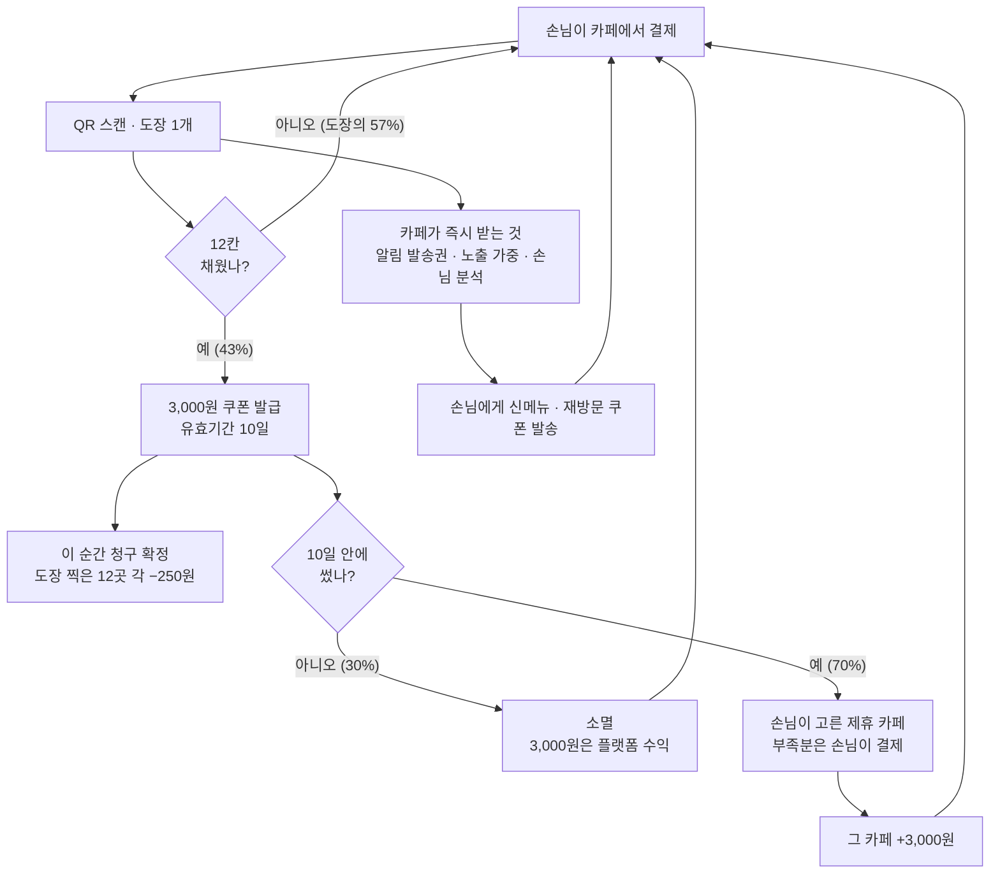
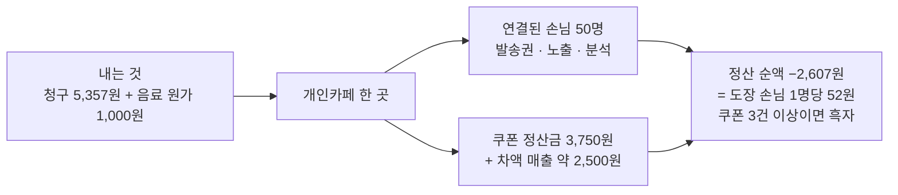
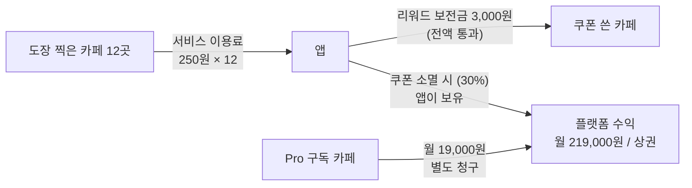

# 스탬프 혜택 정책 — 카페는 무엇을 내고 무엇을 받는가

> **이 문서가 정하는 것**
> ① 도장 1개당 얼마를 받을 것인가 — **업계 마케팅 단가에서 역산한 금액**
> ② 도장을 찍어주는 카페와 쿠폰을 받는 카페, **양쪽 모두** 억울하지 않게 만드는 방법
> ③ 그 위에서 **플랫폼은 어디서 돈을 버는가**
>
> **상위 문서:** `개인카페_서비스_아이디에이션.md` · **작성일:** 2026-08-13 · **상태:** 아이디에이션
>
> ⚠️ **이 문서가 최신 판단이다.** §7·§10의 정산 구조는 상위 문서 §4가 한때 금지했던 모델(자금이 카페 사이를 오가는 구조)을 **의도적으로 번복한 것**이다. 상위 문서 §4에 번복 사유가 기록돼 있다.

---

## 0. 한 장 요약

**손님이 서로 다른 개인카페 12곳에서 도장을 찍으면, 3,000원 쿠폰이 생긴다.
쿠폰은 제휴 카페 어디서나 10일 안에 써야 하고, 그 3,000원은 도장을 찍어준 12곳이 250원씩 나눠 낸다.**

| 질문 | 답 |
|---|---|
| 리워드 | 서로 다른 카페 **12곳** → **3,000원 금액권**, 유효기간 **10일** |
| 쿠폰은 어디서 쓰나 | **제휴 카페 중 손님이 직접 고른다.** 이미 도장을 찍은 곳이어도 된다 |
| 누가 내나 | 도장을 찍어준 **12곳이 250원씩** (합계 3,000원) |
| **카페 월 청구액** | **약 5,357원** — 도장 손님 1명당 **107원** (§3) |
| **카페 월 정산 순액** | **평균 −2,607원** — 도장 손님 1명당 **52원** (§3) |
| 쿠폰을 받은 카페는 | 정산금 3,000원 + **손님 차액 결제** − 원가 → **약 +4,200원** |
| 도장을 찍은 카페는 | **알림 발송권 · 홈 노출 가중 · 손님 분석** — **도장 찍는 즉시** (§4) |
| 언제 청구되나 | **12칸을 채워 쿠폰이 생기는 순간.** 도장을 찍을 때가 아니다 (§7) |
| 12칸을 못 채우면 | **아무도 한 푼도 내지 않는다** |
| 쿠폰이 소멸하면 | 청구는 유효하고, 그 돈은 **플랫폼 수익**이 된다 (§6) |
| 앱은 어디서 버나 | 도장 분담금에서는 **0원.** **Pro 구독 + 소멸 쿠폰 대금** (§5·§6) |

> **한 문장:** *"손님 한 명과 연결되는 데 52원. 인스타 광고 클릭 한 번의 3%이고, 이미 우리 가게에서 결제한 사람이다."*

---

## 1. 어떻게 돌아가나

```
   손님이 카페에서 결제하고 QR을 찍는다 → 도장 1개
   (한 카페당 도장 1개. 서로 다른 카페여야 쌓인다)
                      │
                      │  ← 이 순간, 카페는 대가를 받는다 (§4)
                      ▼
        12번째 도장이 찍히는 순간 → 3,000원 쿠폰 발급 🎫
                      │
                      │  ← 이 순간, 12곳에 250원씩 청구가 확정된다 (§7)
                      ▼
              ⏳ 10일 안에 써야 한다
                      │
        ┌─────────────┴─────────────┐
        ▼                           ▼
  손님이 고른 제휴 카페에서 사용      기간 만료 → 소멸
        │                           │
        ▼                           ▼
  그 카페가 3,000원을 받는다      그 3,000원은 플랫폼 수익
  (부족분은 손님이 결제)
```

**쿠폰을 쓰는 카페는 손님이 고른다 — 확정**

- 우리 서비스에 등록된 카페 안에서라면 **어디를 고르든 손님 자유**다
- 도장을 찍었던 카페에서 써도 된다. 그 카페는 **250원을 내고 3,000원을 받는다**
- 앱은 **최근 사용 건수가 적은 곳을 위에 보여줄 뿐**, 선택을 제한하지 않는다 (편중 방지)

---

## 2. 금액을 어디서 가져왔나 — 업계 마케팅 단가 ★

**개인카페가 지금 손님 1명에게 쓰는 돈이 기준선이다.**

| 조사 항목 | 값 |
|---|---|
| 개인카페 월 손님 수 | 약 **1,500명** (일 50명 · 월 매출 600만~1,000만원대) |
| 숙박·음식점업 소상공인 월평균 온라인 광고비 | **24만원** (배달앱 포함 — 비배달 개인카페엔 과대치) |
| 인스타그램 광고 자영업 권장 시작 예산 | **월 30만원** (CPC 약 1,650원) |
| 네이버 플레이스 광고 | CPC 50~5,000원 / 지역소상공인광고 유효노출당 1원 |
| 배달앱 **광고비만** 매출 대비 | **2.9%** (총 수수료는 16.9~29.3%) |
| **→ 손님 1명당 마케팅비** | **최대 약 200원** (24만원 ÷ 1,500명 = 160원 / 30만원 ÷ 1,500명 = 200원) |

### 역산

```
목표: 도장 손님 1명당 부담을 200원 아래로 넣는다
      ↓
쿠폰 3,000원 ÷ 도장 12개 = 도장 1개당 250원
      ↓
청구는 완주에 기여한 도장에만 (도달률 20% 기준 43%)
      ↓
도장 손님 1명당 청구  107원   ◎
쿠폰 정산금까지 반영한 실부담  52원   ◎
```

### 왜 쿠폰을 3,000원으로 낮췄나 — 쿠폰 받는 카페는 손해가 없다

| | 5,000원 쿠폰 | **3,000원 쿠폰** |
|---|---|---|
| 앱에서 받는 정산금 | 5,000원 | 3,000원 |
| 손님이 내는 차액 | 0원 | **약 2,000원** |
| 음료 원가 | −800원 | −800원 |
| **쿠폰 받는 카페의 이익** | **+4,200원** | **+4,200원** |
| 도장 찍는 카페의 표시 단가 | 500원 | **250원** |

> **쿠폰이 음료 값보다 작으면 손님이 차액을 결제한다.** 쿠폰 받는 카페의 이익은 그대로이고, **줄어드는 건 도장 찍는 카페의 부담뿐**이다.
> ⚠️ 위 계산은 **음료 단품 5,000원** 기준이다(§13의 객단가 6,500원은 디저트 등을 포함한 값이라 다른 개념). 손님이 3,000원 이하 메뉴를 고르면 차액은 0이고, 그때 쿠폰 카페의 이익은 +2,200원으로 줄어든다.

---

## 3. 카페 한 곳의 한 달 — 점주에게 보여줄 화면 ★

**점주에게는 도장 단가가 아니라 월 예상 금액을 보여준다.** 마케팅 예산은 월 단위로 생각하기 때문이다.

> ### 이번 달 예상
> **상권 평균 기준 — 약 1,000원** (도장 손님 한 분당 52원)
> **연결된 손님 50명** · 쿠폰 방문 1.25건
>
> *쿠폰을 3건 이상 받으시면 이번 달은 **플러스**로 끝납니다.*

### 계산 (상권 30곳 · 월 완주 54건 · 소멸률 30% 기준)

| | 계산 | 금액 |
|---|---|---|
| 우리 가게에서 찍힌 도장 | 월 **50개** (그중 완주 기여 43%) | |
| **낼 돈** | 21.4개 × 250원 | **−5,357원** |
| **받을 돈** | 쿠폰 **1.25건** × 3,000원 | **+3,750원** |
| 음료 원가 | 1.25잔 × 800원 | **−1,000원** |
| **정산 순액 (상권 평균)** | | **−2,607원** |
| 그 외 | 손님 **차액 결제 약 2,500원** (매출) | |
| **얻은 것** | **연결된 손님 50명** (발송권 50장) · 방문 1.25건 | |

### 쿠폰을 몇 건 받느냐가 전부를 가른다

| 그달 쿠폰 수령 | 정산 순액 |
|---|---|
| 0건 (쿠폰 받기를 끔) | −5,357원 |
| **1.25건 (상권 평균)** | **−2,607원** |
| 2건 | −957원 |
| **3건 이상** | **+1,243원 — 흑자 전환** |

> **왜 평균이 마이너스일 수밖에 없나:**
> ```
> 카페 전체의 정산 순액 합계 = −(소멸 대금) − (음료 원가)
> ```
> 카페들이 실제로 부담하는 건 **① 손님에게 내준 음료 원가**와 **② 앱이 가져간 소멸 대금** 둘뿐이다. 이 구조에서 전체 평균이 플러스가 되는 것은 산술적으로 불가능하다. 개별 카페는 쿠폰을 평균보다 많이 받으면 흑자가 된다.

### 단가 비교 — 분모가 다르다는 점에 주의

| 비교 대상 | 값 | **분모** |
|---|---|---|
| 인스타그램 광고 | 1,650원 | **클릭 1회당** (방문 아님) |
| 소상공인 평균 온라인 광고 | 약 160원 | 전체 손님 1,500명당 |
| **이 앱 — 청구 기준** | **107원** | 도장 찍은 손님 50명당 |
| **이 앱 — 정산 순액 기준** | **52원** | 도장 찍은 손님 50명당 |

> **도장 손님의 결제액 대비 1.7%** (5,357원 ÷ 50명 × 6,500원). 월 매출 전체 대비로는 0.05~0.09% 수준이다 — 두 숫자를 섞어 쓰지 않는다.

---

## 4. 도장을 찍는 즉시 카페가 받는 것 ★

**청구는 완주할 때, 대가는 도장 찍을 때.** 이 비대칭이 카페에게 유리한 지점이다.

| 도장 1개를 찍어주면 | 내용 |
|---|---|
| **① 알림 발송권 1장** | 그 손님에게 **신메뉴·이벤트·재방문 쿠폰**을 보낼 권리 (유효 6개월) |
| **② 홈 노출 가중** | 그 손님의 앱 홈에 **'다녀온 카페'** 우선 노출 + 상권 검색 순위 상승 |
| **③ 손님 분석** | 방문 시간대·요일, **처음 온 손님/다시 온 손님** 비율, 선호 무드 |

**동의는 계산대가 아니라 앱에서 받는다.** 도장 찍는 화면에서 **"이 카페 소식 받기"** 한 번 누르면 끝이다. *"저희 카카오채널 추가하시면…"* 이 계산대에서 실패하는 문제를 우회한다.

- 카페별로 **손님이 언제든 끌 수 있다** · 한 손님에게 **월 2회 상한** · **야간(21~08시) 차단**
- ⚠️ 광고성 정보는 **사전 동의 분리**가 법적 요건이다(정보통신망법). 방문 인증 동의와 알림 동의를 반드시 나눠 받는다
- 손님 데이터는 **개인 식별 없이 집계값만** 제공한다(개인정보보호법)

> **12칸을 못 채운 손님의 도장에는 청구가 없다.** 전체 도장의 약 57%가 여기 해당하고, 그 도장들에 대해서도 카페는 위 세 가지를 그대로 가진다.
> ⚠️ 다만 **이 세 가지가 실제로 250원어치인지는 아직 검증되지 않았다** (§13 결정2). 발송권 → 재방문 전환율이 이 정책의 유일한 근거다.

---

## 5. 무료와 유료의 경계선 — Pro 구독

§4의 세 가지를 전부 무료로 주면 앱이 팔 것이 없어진다. 그래서 선을 하나 긋는다.

> **성과를 보여주는 것은 무료. 그 성과를 크게 쓰는 도구는 유료.**

| | **무료** (도장 250원의 대가) | **Pro 구독** |
|---|---|---|
| **알림** | 발송권 적립 · **한 명씩 개별 발송** | **일괄 발송 · 예약 발송 · 조건 타겟팅**("3개월 안 온 손님만") |
| **노출** | 발행량 비례 **자동** 가중 | **시간대·요일 지정 부스트** · 신메뉴 배너 |
| **분석** | 이번 달 숫자 | **기간 비교 · 손님 세그먼트 · 상권 벤치마크 · 주간 리포트** |

**전환이 일어나는 지점:** 무료로도 발송권이 **월 50장씩 쌓인다.** 개별 발송만으로는 다 쓰기 번거로워지는 지점에서 Pro가 필요해진다.

- 구독료 **월 19,000원** (초기 3개월 무료) — 인스타 광고 월 30만원의 6%
- ⚠️ **가정:** 구독료와 전환율은 근거 없는 초기 추정치다. **무료 3종을 3개월 써본 뒤** 지불의향을 조사한다
- ⚠️ 무료 기능을 의도적으로 불편하게 만들어 전환을 유도하지 않는다 — 개별 발송은 **한 명에게 보내는 용도로 충분히 편해야** 한다

---

## 6. 소멸한 쿠폰 대금은 플랫폼 수익 ★

쿠폰이 10일 안에 안 쓰이면 소멸한다. 그때 **이미 확정된 3,000원은 카페로 돌아가지 않고 플랫폼 수익이 된다.**

| | 값 |
|---|---|
| 월 완주(쿠폰 발급) 건수 | 54건 |
| 확정 청구액 | 162,000원 |
| 소멸률 30% 가정 | 16건 |
| **월 소멸 수익 / 상권 1개** | **48,000원** |

### 앱의 상권 1개당 월 수익

| 항목 | 금액 | 비중 |
|---|---|---|
| Pro 구독 (30곳 × 전환 30% × 19,000원) | 171,000원 | 78% |
| 소멸 쿠폰 대금 | 48,000원 | **22%** |
| **합계** | **219,000원** | |

> **⚠️ 이해상충 — 반드시 짚어둔다:** 이 구조에서 **앱은 쿠폰이 안 쓰이는 편이 이득이다.** 유효기간을 짧게 잡거나 사용을 불편하게 만들 유인이 생긴다. 소멸 수익이 전체의 22%라 무시할 수 있는 규모도 아니다.
>
> **통제 방법 — 수익 비중이 아니라 소멸률 자체를 관리한다.**
> - **소멸률 상한 30%.** 초과하면 쿠폰 유효기간을 자동으로 14일로 연장한다 (§12)
> - 소멸률을 **KPI 목표로 삼지 않는다.** 올리는 방향의 목표는 어떤 문서에도 쓰지 않는다
> - 유효기간·사용 절차 변경은 **손님 편의 기준으로만** 판단한다

---

## 7. 언제 청구하고 언제 정산하나

### ① 청구 확정 = 쿠폰이 생기는 순간

| 시점 | 무슨 일이 일어나나 |
|---|---|
| 도장을 찍을 때 | **아무 돈도 오가지 않는다.** 카페는 §4의 세 가지만 가져간다 |
| **12칸을 채워 쿠폰이 생길 때** | **12곳에 250원씩 청구가 확정된다** |
| 쿠폰을 쓸 때 | 사용처 카페에 3,000원 지급이 확정된다 |
| 쿠폰이 소멸할 때 | 청구는 유효, 지급은 없음 → **차액이 플랫폼 수익** (§6) |

### ② 쿠폰 사용 확인 절차

지급 3,000원을 확정하는 **유일한 이벤트**이므로 절차를 명시한다.

1. 손님이 앱에서 쿠폰을 열면 **60초 카운트다운이 도는 사용 화면**이 뜬다 (캡처 재사용 방지)
2. 점주가 매장 태블릿/점주 앱으로 **손님 화면의 코드를 스캔**하거나, 점주 화면에서 **[사용 처리]** 를 누른다
3. 처리 즉시 양쪽 화면에 **"사용 완료"** 가 뜨고 쿠폰은 소진된다 — 되돌리기는 당일 내 점주 요청으로만
4. **오프라인 상황:** 앱이 6자리 대체 코드를 표시하고, 점주가 나중에 입력해도 사용 시각은 손님이 코드를 연 시각으로 기록된다

### ③ 현금은 월 1회 · 순액으로 한 번만 움직인다

```
낼 돈 5,357원  −  받을 돈 3,750원  =  낼 순액 1,607원
                                        ↑ 한 번만 이체한다
```

- **매월 말 집계 → 익월 10일 자동이체(CMS) 1건**
- **앱은 현금을 보관하지 않는다.** 쿠폰이 살아 있는 10일 동안 움직이는 건 장부상 채권뿐이고, 현금은 월말에 한 번 정산된다
- **Pro 구독료는 별도 청구** — 리워드 정산금과 섞지 않는다 (섞으면 "앱이 떼간다"는 오해가 생긴다)

---

## 8. 12곳은 멀다 — 완주율을 지키는 장치 ★

도장 12개는 **월 4곳 방문 기준 약 3개월**이다. 손님이 중간에 포기하면 **정산도 방문도 아예 생기지 않는다.** 이 안의 가장 큰 위험이고, 다음 장치로 막는다.

| 장치 | 내용 |
|---|---|
| **카드는 무기한** | 유효기간을 두는 건 **쿠폰(10일)뿐이다.** 도장 카드 자체는 만료되지 않는다 |
| **진행률 알림** | 6/12(절반) · 9/12(**"3곳만 더!"**) · 11/12에 푸시 1회씩 |
| **다음 목적지 제안** | 지도에 **아직 안 가본 참여 카페**를 표시 — 탐색 기능이 그대로 완주 장치가 된다 |
| **완주 후 즉시 재시작** | 12칸을 채우면 **다음 카드가 바로 열린다.** 쿨다운 없음 |
| **커버리지 요건 상향** | 12곳을 채우려면 상권에 **최소 25곳 이상** 참여해야 한다. 상위 문서의 "카페 30~50곳 · 커버리지 60%"가 **선택이 아니라 전제 조건**이 된다 |

> ⚠️ **이 문서의 모든 숫자는 도달률 20%를 전제로 한다.** 배포 카드 대비 12칸 도달률이 20%에 못 미치면 §3의 계산이 통째로 흔들린다. 미달 시 **도장 개수를 10개(도장당 300원)로 내린다** — 완주는 쉬워지지만 카페 부담은 오히려 커진다는 점을 감수하는 선택이다.

---

## 9. 억울한 사람이 없게

### 도장을 찍어주는 카페 쪽

| 억울할 수 있는 상황 | 장치 |
|---|---|
| **우리 손님인데 왜 우리가 내나** | **도장 찍는 즉시 §4의 세 가지를 받는다.** 청구는 나중에, 대가는 지금 |
| **250원이 부담된다** | 도장 손님 1명당 실부담 **52원** — 소상공인 평균 온라인 광고비(160원/명)의 3분의 1 |
| **평균이 마이너스다** | 사실이다(§3). **쿠폰을 3건 이상 받으면 흑자**로 돌아서고, 그 전까지도 손님 50명과의 연결이 남는다 |
| **나가는 돈이 예측이 안 된다** | 점주 화면에 **월 예상 금액**으로 표시 + **월 분담 상한**(기본 2만원)을 직접 설정 |

### 쿠폰을 받는 카페 쪽

| 억울할 수 있는 상황 | 장치 |
|---|---|
| **3,000원어치를 그냥 내준다** | **3,000원을 받고, 손님이 차액도 결제한다** → 실질 +4,200원 |
| **하루에 몰려와서 감당이 안 된다** | **일 한도**(기본 5건). 채우면 그날은 사용처 목록에서 자동 제외 |
| **쿠폰 손님이 인기 카페로만 간다** | 사용처를 보여줄 때 **최근 사용 건수가 적은 곳을 위로** (선택은 손님 자유) |

---

## 10. 앱이 금융업이 되지 않으려면

| 구조 | 앱의 위치 | 판정 |
|---|---|---|
| 앱이 A의 돈을 **맡아 두었다가** B에게 전달 | 자금 이전 중개 | ✕ **하지 않는다** |
| **앱이 A에게 이용료를 청구하고, 앱이 B에게 보전금을 지급** | **거래 당사자** | **◎ 채택** |

앱은 전달자가 아니라 **양쪽과 각각 계약한 당사자**다. 카페 A는 앱에 **서비스 이용료**를 내고, 앱은 카페 B에 **리워드 보전금**을 지급한다.

**지켜야 할 선 3개**

1. **손님이 충전하거나 환급받을 수 있는 것은 만들지 않는다** — 쿠폰은 물품 교환권이지 금전이 아니다. 잔액 환급·현금 거스름 없음
2. **앱이 현금을 보관하지 않는다** — 쿠폰 유효기간 동안 움직이는 건 장부상 채권뿐, 현금은 월말 순액 1회 (§7③)
3. **카페 사이에 직접 채권·채무가 생기지 않게 한다** — 모든 계약은 앱과 각 카페 사이 1:1

> ⚠️ **가정 — 사실로 쓰지 말 것:** 위 구조가 전자금융거래법상 자금이체업·선불전자지급수단에 해당하지 않는다는 **방향은 합리적이나, 법률 검토를 받지 않았다.** **특히 §6 소멸 대금을 앱이 수취하는 구조는 별도 검토가 필요하다.**

---

## 11. 새는 구멍 막기

| 위험 | 막는 방법 |
|---|---|
| 안 가고 QR 사진만 찍기 | 매장 화면의 **회전 코드** 또는 **GPS + QR** 이중 확인 |
| 같은 카페에서 여러 번 | **한 카페당 도장 1개** · 하루 1회 |
| 계정 여러 개로 반복 완주 | 기기·결제수단 기준 **중복 계정 탐지** (완주 횟수 자체는 제한하지 않는다) |
| 지인 카페끼리 도장 품앗이 | **물리적으로 불가능한 이동**(거리 ÷ 시간)이 감지되면 자동 검토. *하루 2~3곳 방문은 정상 사용이므로 건수만으로 판정하지 않는다* |
| 유령 매장 등록 | 온보딩 시 **사업자등록증 확인** (초기엔 수기 검수) |
| 쿠폰 손님이 하루에 몰림 | **일 한도 5건** |
| 쿠폰 화면 캡처 재사용 | **60초 카운트다운 + 점주 스캔** (§7②) |
| 알림 남발로 손님 이탈 | **손님당 월 2회 상한 · 카페별 수신거부 · 야간 차단** |

---

## 12. 설정값 한눈에

| 항목 | 기본값 | 언제 바꾸나 |
|---|---|---|
| 완주 조건 | 서로 다른 카페 **12곳** | **12칸 도달률 20% 미만이면 10곳으로** (§8) |
| 쿠폰 | **3,000원 금액권** | 손님 완주 동기가 약하면 상향 |
| 도장 1개당 분담 | **250원** (쿠폰 ÷ 12) | 완주 조건이 바뀌면 자동으로 바뀜 |
| 쿠폰 유효기간 | **10일** (D-3 알림 1회) | **소멸률 30% 초과 시 자동으로 14일** |
| 도장 카드 유효기간 | **없음** · 완주 후 즉시 재시작 | — |
| 잔액 처리 | **환급·거스름 없음** | — |
| 앱 수수료 | **0%** — 250원 전액이 카페로 | 바꾸지 않는다 |
| 소멸 쿠폰 대금 | **전액 앱 수익** | 소멸률로 관리 (수익 비중으로 관리하지 않음) |
| 알림 발송권 | 도장 1개당 1장 · 유효 6개월 | — |
| 손님당 알림 상한 | 월 2회 | 수신거부율 상승 시 |
| 쿠폰 사용 일 한도 | 5건 (점주 설정) | 응대 부담 호소 시 |
| 월 분담 상한 | 20,000원 (점주 설정) | 도달 시 도장 발행·쿠폰 수령 함께 정지 |
| Pro 구독료 | 월 19,000원 (3개월 무료) | 점주 WTP 조사 결과에 따라 |
| 점주 화면 가격 표시 | **월 예상 금액** | — |

---

## 13. 예외 처리 ★

정산이 걸려 있는 이상, 예외를 정하지 않으면 첫 달에 바로 막힌다.

| 상황 | 처리 |
|---|---|
| **12곳 중 일부가 못 낸다** (월 상한 도달·미납·폐업) | **부족분은 앱이 부담한다.** 쿠폰 금액은 손님에게 3,000원 그대로 유지된다 — 손님에게 카페 사정이 전가되지 않는다 |
| **월 분담 상한 도달** | 그 달은 **도장 발행과 쿠폰 수령이 함께 정지**된다. 내지 않으면 받지도 않는다 |
| **자동이체 실패** | 1회 재시도 후 도장 발행·쿠폰 수령 동시 정지. 납부 확인 시 즉시 재개 |
| **카페 폐업·탈퇴** | 이미 확정된 청구는 유효. 미납분은 앱이 부담하고 손실 처리한다. 진행 중인 손님 카드의 그 카페 도장은 **유효하게 유지**된다 |
| **부가세** | 도장 분담금 250원과 쿠폰 보전금 3,000원은 **VAT 별도**로 표기하고, 앱↔카페 양방향 모두 **세금계산서를 발행**한다. 점주 화면 금액은 VAT 포함가로 보여준다 (250원 → 275원) |
| **손님 결제 취소** | 결제 취소 시 그 도장은 회수된다. 이미 쿠폰이 발급된 뒤라면 쿠폰은 유효하고 청구도 유지한다 |
| **손님 탈퇴** | 미완성 카드는 소멸. 이미 확정된 청구·지급 기록은 **정산 증빙으로 5년 보존**하되 개인 식별 정보는 즉시 분리·파기한다 |
| **청구 이의제기** | 점주 화면에서 건별 명세(어느 손님의 몇 번째 도장인지, 개인 식별 없이)를 확인하고 **14일 내 이의 신청** 가능 |
| **단가 변경** | 이미 찍힌 도장에는 **찍힌 시점의 단가**를 적용한다. 소급하지 않는다 |

---

## 14. 아직 정하지 못한 것 · 확인해야 할 것

**[결정 필요]**

| # | 결정할 것 | 권고 |
|---|---|---|
| 1 | **12칸 도달률이 실제로 20%인가** | 이 문서 전체가 이 값 위에 서 있다. 종이 카드로 먼저 측정 |
| 2 | **§4의 세 가지가 실제로 250원어치인가** | **발송권 → 재방문 전환율**을 초기에 반드시 측정 |
| 3 | **차액 결제가 실제로 발생하는가** | 3,000원 이하 메뉴만 고르면 차액이 0이다. 사용 내역으로 확인 |
| 4 | **소멸률이 30%인가** | 이 값이 앱 수익의 22%와 §6 이해상충 판단을 좌우한다 |
| 5 | **Pro 구독료 19,000원 지불의향** | 무료 3종을 3개월 써본 뒤 조사 |

**⚠️ 가정 — 사실로 쓰지 말 것**

- **12칸 도달률 20% · 완주 기여율 43%** — 미검증. 기여율은 "미완주자가 평균 4개를 모은다"는 가정에서 나온 값이다
- **카페 월 도장 50개 · 음료 단품 5,000원 · 원가 800원 · 객단가 6,500원** — 전부 추정치
- **소멸률 30%** — 전혀 모른다. 첫 실측 대상
- **Pro 구독료 19,000원 · 전환율 30%** — 근거 없는 초기 추정치
- **§10 법적 구조, 특히 §6 소멸 대금 수취** — 법률 검토 전. 정산 개시 전 필수 확인
- 이 문서 전체는 **"스탬프가 있으면 사람들이 새 카페를 더 다닌다"** 는 가설 위에 서 있다

**조사 출처**
[소상공인 온라인광고비](https://www.nongmin.com/article/20210201333018) · [배달앱 수수료 실태](https://www.asiatime.co.kr/article/20251218500392) · [인스타 광고 단가](https://www.helpsns.com/blog/instagram-ads-cost-guide-2026/) · [네이버 플레이스 광고](https://ceoscoredaily.com/page/view/2021061713402173018) · [개인카페 매출 구조](https://talk.cashnote.kr/article/CONTENT/39425)

---

## 15. 전체 흐름도

### 도장부터 정산까지



### 카페 한 곳이 내는 것과 받는 것 (상권 평균)



### 돈이 흐르는 방향 — 앱은 전달자가 아니라 당사자


